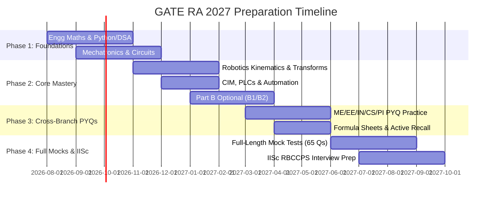

# Master Preparation Strategy & Roadmap: GATE RA 2027 & Target IISc RBCCPS

---

## 🌟 The Big Picture: Why You Have a Massive First-Mover Advantage
1. **Brand New Paper = Highest ROI on Fundamentals**: In the inaugural year of any GATE paper (just like Data Science & AI in 2024), question setters focus on **standard textbook concepts, direct formula applications, and fundamental numericals** rather than overly obscure edge cases.
2. **Targeting IISc RBCCPS (Robert Bosch Centre for Cyber-Physical Systems)**:
   - IISc RBCCPS offers premier programs in **Robotics & Autonomous Systems (M.Tech / M.Tech Research / Ph.D.)**.
   - With the RA paper, IISc has a direct benchmark tailored precisely to their curriculum (Math + Kinematics + Controls + Sensors/Circuits + Python/DSA).
   - Scoring high in GATE RA will put you at the absolute top of the shortlist for RBCCPS interviews and direct admissions!

---

## 🎯 4-Phase Timeline to GATE 2027

---

## 📚 Exact Textbook & Video Lecture Mapping

| Module | Core Topics | Recommended Standard Book | Best Free Video Lectures / NPTEL |
| :--- | :--- | :--- | :--- |
| **Robotics (Part A.3)** | 2D/3D Rotations, Homogeneous Transforms, DH Convention, Forward Kinematics, DOF | **John J. Craig** (*Introduction to Robotics*) OR **Spong & Vidyasagar** | **Prof. Asokan T & Prof. Ashish Dutta (IITM/IITK)** NPTEL, **Prof. Kevin Lynch (Modern Robotics)** |
| **Automation & CIM (Part A.3)** | PLCs, CNC G/M codes, AS/RS, Material Handling, AIDC | **Mikell P. Groover** (*Automation, Production Systems, & CIM*) | **Prof. J. Ramkumar (IITK)** NPTEL / **Prof. S.N. Joshi (IITG)** |
| **Sensors & Circuits (Part A.2)** | Network theorems, Op-Amps, LVDT, Encoders, Accelerometers | **W. Bolton** (*Mechatronics*) & **Doebelin** (*Measurement Systems*) | **Prof. Hardik J. Pandya (IISc Bangalore)** & **Prof. Pushparaj Mani Pathak (IITR)** |
| **Actuators (Part A.2)** | DC, BLDC, Stepper, Servo torque-speed characteristics, Hydraulics/Pneumatics | **P.S. Bimbhra** (Electrical Machines) & **Majumdar** (Pneumatics & Hydraulics) | **Prof. T.K. Bhattacharya (IIT KGP)** |
| **Python & DSA (Part A.2)** | Python syntax, Stacks, Queues, Trees, Graphs, Search/Sort | **Problem Solving with Algorithms & Data Structures in Python** | **Prof. Madhavan Mukund (NPTEL)** & **Abdul Bari (YouTube)** |
| **Engineering Maths (Part A.1)** | Linear Algebra, Calculus, Diff Eq, Probability, Numerical | **B.S. Grewal** / **Gilbert Strang (MIT)** | **Prof. Gilbert Strang 18.06 (MIT OCW)** & **G-Centric / NPTEL Maths** |
| **Optional Part B1 (EE)** | Control Systems, Signals & Systems, Analog & Embedded | **Katsuhiko Ogata** & **Alan V. Oppenheim** | **Prof. Ramkrishna Pasumarthy (IITM)**, **Brian Douglas** |
| **Optional Part B2 (ME)** | Strength of Materials, Theory of Machines, Machine Design | **Beer & Johnston**, **SS Rattan**, **Shigley** | **Prof. S.P. Harsha (IITR)**, **NPTEL ME Playlists** |

---

## 💡 How to Build Your Notes & Materials Here
Since ready-made commercial coaching notes do not exist yet for this fresh paper, we will build **the most comprehensive, mathematically precise, and illustrated notes right inside this workspace**:
1. **Derivations & Clean Formulas**: Matrix transformations, DH tables step-by-step, PLC ladder logic diagrams, Op-Amp derivations.
2. **Concept Visualizations & Python Code**: Run simulation scripts directly to plot manipulator workspaces, motor torque-speed curves, and filter frequency responses.
3. **Cross-Disciplinary PYQ Compilations**: Curating past questions from GATE ME, EE, IN, CS, and PI that match every syllabus line.
