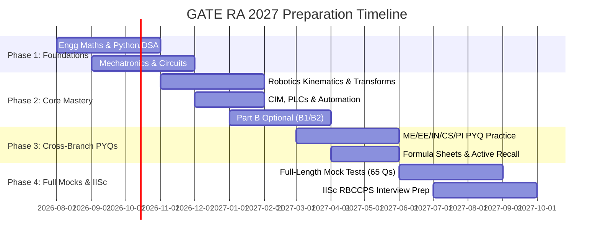

# Master Preparation Strategy & Roadmap: GATE RA 2027 & Target IISc RBCCPS

---

## 🌟 The Big Picture: Why You Have a Massive First-Mover Advantage
1. **Brand New Paper = Highest ROI on Fundamentals**: In the inaugural year of any GATE paper (just like Data Science & AI in 2024), question setters focus on **standard textbook concepts, direct formula applications, and fundamental numericals** rather than overly obscure edge cases.
2. **Targeting IISc RBCCPS (Robert Bosch Centre for Cyber-Physical Systems)**:
   - IISc RBCCPS offers premier programs in **Robotics & Autonomous Systems (M.Tech / M.Tech Research / Ph.D.)**.
   - With the RA paper, IISc has a direct benchmark tailored precisely to their curriculum (Math + Kinematics + Controls + Sensors/Circuits + Python/DSA).
   - Scoring high in GATE RA will put you at the absolute top of the shortlist for RBCCPS interviews and direct admissions!

---

## 🎯 4-Phase Timeline to GATE 2027

```mermaid
gantt
    title GATE RA 2027 Preparation Timeline
    dateFormat  YYYY-MM
    section Phase 1: Foundations
    Engg Maths & Python/DSA          :2026-08, 3M
    Mechatronics & Circuits          :2026-09, 3M
    section Phase 2: Core Mastery
    Robotics Kinematics & Transforms :2026-11, 3M
    CIM, PLCs & Automation           :2026-12, 2M
    Part B Optional (B1/B2)          :2027-01, 3M
    section Phase 3: Cross-Branch PYQs
    ME/EE/IN/CS/PI PYQ Practice      :2027-03, 3M
    Formula Sheets & Active Recall   :2027-04, 2M
    section Phase 4: Full Mocks & IISc
    Full-Length Mock Tests (65 Qs)   :2027-06, 3M
    IISc RBCCPS Interview Prep       :2027-07, 3M
```

---

## 📚 Exact Textbook & Video Lecture Mapping

| Module | Core Topics | Recommended Standard Book | Best Free Video Lectures / NPTEL |
| :--- | :--- | :--- | :--- |
| **Robotics (Part A.3)** | 2D/3D Rotations, Homogeneous Transforms, DH Convention, Forward Kinematics, DOF | **John J. Craig** (*Introduction to Robotics*) OR **Spong & Vidyasagar** | **Prof. Asokan T & Prof. Ashish Dutta (IITM/IITK)** NPTEL, **Prof. Kevin Lynch (Modern Robotics)** |
| **Automation & CIM (Part A.3)** | PLCs, CNC G/M codes, AS/RS, Material Handling, AIDC | **Mikell P. Groover** (*Automation, Production Systems, & CIM*) | **Prof. J. Ramkumar (IITK)** NPTEL / **Prof. S.N. Joshi (IITG)** |
| **Electric Circuits & Networks (Part A.2)** | KCL, KVL, Nodal/Mesh, Thevenin, Norton, Superposition, MPT, Transients (RL/RC/RLC), AC Resonance, 3-Phase | **Alexander & Sadiku** (*Fundamentals of Electric Circuits*) | **Prof. Nagendra Krishnapura (IIT Madras)** NPTEL |
| **Engineering Mechanics (Part A.2)** | FBD, Equilibrium, Friction, Belt-Pulley, Trusses, Rigid Body Plane Motion | **J.L. Meriam & L.G. Kraige** (*Engineering Mechanics*) | **Prof. Manoj K. Harbola (IIT Kanpur)** NPTEL |
| **Sensors & Actuators (Part A.2)** | Strain gauges, LVDT, Hall effect, Piezoelectric, Op-Amps, DC/Stepper/Servo motors, Hydraulics | **W. Bolton** (*Mechatronics*) & **Doebelin** (*Measurement Systems*) | **Prof. Hardik J. Pandya (IISc Bangalore)** & **Prof. S. Mukhopadhyay (IITKGP)** |
| **Digital Logic & Python/DSA (Part A.2)** | K-Maps, MUX, Flip-Flops, Counters, Python syntax, Stacks, Queues, BSTs, Graphs | **Morris Mano** & **Problem Solving with Python (Brad Miller)** | **Prof. Goutam Saha (IITKGP)** & **Prof. Madhavan Mukund (CMI/NPTEL)** |
| **Engineering Maths (Part A.1)** | Linear Algebra, Calculus, Diff Eq, Probability, Numerical Methods | **Erwin Kreyszig** / **Gilbert Strang (MIT)** | **Prof. Jitendra Kumar (IITKGP)** & **Prof. Somesh Kumar (IITKGP)** |
| **Optional Part B1 (EE)** | Control Systems, Signals & Systems, Analog & Embedded Systems | **Katsuhiko Ogata** & **Alan V. Oppenheim** | **Prof. Ramkrishna Pasumarthy (IITM)**, **Prof. V.M. Gadre (IITB)** |
| **Optional Part B2 (ME)** | Strength of Materials, Theory of Machines, Machine Design & CAD/CAM | **Beer & Johnston**, **SS Rattan**, **Shigley (Machine Design)** | **Prof. S.P. Harsha (IITR)**, **Prof. B. Maiti (IITKGP)** |

---

## 💡 How to Build Your Notes & Materials Here
Since ready-made commercial coaching notes do not exist yet for this fresh paper, we will build **the most comprehensive, mathematically precise, and illustrated notes right inside this workspace**:
1. **Derivations & Clean Formulas**: Matrix transformations, DH tables step-by-step, PLC ladder logic diagrams, Op-Amp derivations.
2. **Concept Visualizations & Python Code**: Run simulation scripts directly to plot manipulator workspaces, motor torque-speed curves, and filter frequency responses.
3. **Cross-Disciplinary PYQ Compilations**: Curating past questions from GATE ME, EE, IN, CS, and PI that match every syllabus line.
