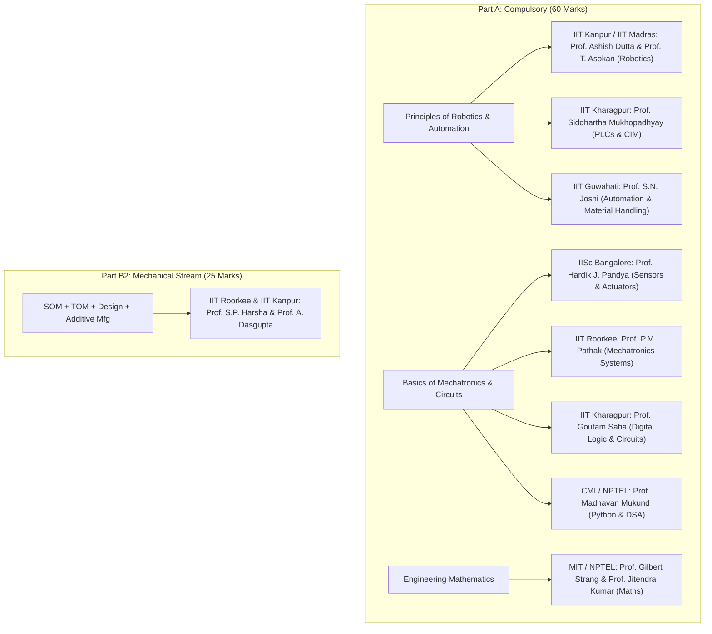

# NPTEL Video Lectures & Syllabus Alignment Matrix: GATE 2027 RA

**Organizing Institute:** IIT Madras  
**Target:** 100% Official GATE RA Syllabus Verification & Lecture-by-Lecture Video Mapping

---

## 📌 Matrix Overview: How NPTEL Matches the GATE RA Syllabus

---

# 1. Section A.3: Principles of Robotics and Automation

### Course 1: *Introduction to Robotics*
* **Instructors:** Prof. Ashish Dutta (IIT Kanpur) & Prof. T. Asokan (IIT Madras)
* **Course Code / Platform:** NPTEL / Swayam (Mech/Aero/EE)
* **Syllabus Confirmation:** 100% Matches Section A.3 Robotics

| Lecture / Week | Topic in Video | Exact GATE RA Syllabus Match | Key Summary & Takeaways |
| :--- | :--- | :--- | :--- |
| **Week 1 (Lec 1–4)** | Introduction to Robotics, Types of Joints ($R, P$), Work Volume | Robotic Classification: Serial vs Parallel, Cartesian, Cylindrical, Spherical, SCARA, Articulated | Explains link geometry, joints, workspace envelopes, and degree of freedom calculations. |
| **Week 2 (Lec 5–8)** | Spatial Transformations & Rotation Matrices | Rotation Matrices in 2D & 3D, Homogeneous Transformations ($4 \times 4$) | Derives $R_x(\alpha), R_y(\beta), R_z(\gamma)$, Euler angle sequences, orthogonal properties ($R^T = R^{-1}, \det R = +1$), and HTM composition rules. |
| **Week 3 (Lec 9–12)** | Denavit-Hartenberg (D-H) Parametrization | Forward Kinematics, D-H Convention | Explains the 4 parameters ($\theta_i, d_i, a_i, \alpha_i$), frame assignment along common normal $X_i$ and joint axis $Z_{i-1}$, and composite $^{0}T_n$ matrix calculation. |
| **Week 4 (Lec 13–16)** | Forward & Inverse Kinematics of 2R/3R Arms | Forward Kinematics, Solvability & Reachable Workspace | Geometric and algebraic methods to solve inverse kinematics, multiple solutions, and pieper's criterion for 6-DOF arms. |
| **Week 5 (Lec 17–20)** | Manipulator Jacobians & Singularities | Velocity Kinematics, Singularities | Derivation of $J(q)$ mapping joint rates $\dot{q}$ to end-effector velocities $\dot{x}$. Identifies boundary and interior singularities where $\det(J) = 0$. |
| **Week 11 (Lec 41–44)** | Robot End-Effectors & Gripper Mechanics | Types of End-Effectors (Mechanical, Vacuum, Magnetic) | Gripping force calculations, friction-based vs form-closure grasp, vacuum suction cup payload sizing. |
| **Week 12 (Lec 45–48)** | Motion Control & Performance Metrics | Point-to-Point (PTP) vs Continuous Path (CP), Accuracy, Repeatability, Resolution | Motion interpolation (linear, trapezoidal velocity profile), definition of repeatability vs accuracy and spatial resolution. |

---

### Course 2: *Industrial Automation and Control*
* **Instructor:** Prof. Siddhartha Mukhopadhyay (IIT Kharagpur)
* **Syllabus Confirmation:** 100% Matches Section A.3 (PLCs & CNC) and Section A.2 (Actuators)

| Lecture / Module | Topic in Video | Exact GATE RA Syllabus Match | Key Summary & Takeaways |
| :--- | :--- | :--- | :--- |
| **Module 4 (Lec 14–18)** | Programmable Logic Controllers (PLCs) | PLCs in manufacturing, Architecture, Scan cycle, Ladder Logic | Explains CPU, I/O scan cycle, Ladder rungs, NO/NC contacts, Output coils, Timer On/Off Delay (TON/TOF), Up/Down Counters (CTU/CTD). |
| **Module 5 (Lec 19–22)** | CNC Machines & Positioning Systems | Computer Numerical Control (CNC), Single and Multi-axis positioning | Machine axes convention (Z along spindle), Lead screw & ball screw drives, servo motor feedback, backlash elimination. |
| **Module 7 (Lec 27–31)** | Hydraulic & Pneumatic Actuation Systems | Hydraulic and Pneumatic actuators, Valves, FRL units | Working principles of single/double-acting cylinders, direction control valves (3/2, 4/2, 5/2 DCVs), pressure relief valves, force & speed formulas ($F = P \cdot A, v = Q/A$). |
| **Module 8 (Lec 32–36)** | Electric Drives (DC, BLDC, Stepper) | Torque-speed characteristics of DC, Stepper, and Servo motors | Back-EMF equations, torque constants, speed regulation, unipolar/bipolar stepper excitation modes, microstepping, BLDC Hall sensor commutation. |

---

### Course 3: *Automation in Manufacturing*
* **Instructor:** Prof. Shrikrishna N. Joshi (IIT Guwahati)
* **Syllabus Confirmation:** 100% Matches Section A.3 (CIM, AS/RS, Material Handling, AIDC)

| Lecture / Week | Topic in Video | Exact GATE RA Syllabus Match | Key Summary & Takeaways |
| :--- | :--- | :--- | :--- |
| **Week 1–2** | Introduction to Automation & CIM | Automation in Manufacturing, Fixed vs Flexible Automation | Automation hierarchies (ISA-95), cost analysis, break-even production volume analysis. |
| **Week 6–7** | Automated Material Handling Systems | AGVs (Automated Guided Vehicles), Conveyors | AGV vehicle routing, guidepath technologies (magnetic, laser triangulation, SLAM), fleet sizing and cycle time equations. |
| **Week 8** | Automated Storage & Retrieval Systems (AS/RS) | AS/RS Components & Cycle Time Analysis | Rack structures, S/R cranes, Single-Command ($T_{sc}$) and Dual-Command ($T_{dc}$) travel time calculations. |
| **Week 9** | Auto-ID & Data Capture (AIDC) | Automated identification, detection & capture (AIDC) | 1D Barcodes, 2D QR codes (Reed-Solomon error correction), Active vs Passive RFID transponders, Optical Character Recognition (OCR). |
| **Week 10** | Concurrent Design & Manufacturing Planning | Basics of Concurrent Design and Manufacturing Planning | Design for Manufacturing and Assembly (DFMA), rapid process planning, cell layout optimization. |

---

# 2. Section A.2: Basics of Mechatronics

### Course 4: *Sensors and Actuators*
* **Instructor:** Prof. Hardik J. Pandya (IISc Bangalore)
* **Syllabus Confirmation:** 100% Matches Section A.2 Sensors & Signal Conditioning

| Lecture / Module | Topic in Video | Exact GATE RA Syllabus Match | Key Summary & Takeaways |
| :--- | :--- | :--- | :--- |
| **Lec 1–6** | Resistive & Piezoresistive Sensors | Resistive transducers, Strain Gauges, RTDs, Thermistors | Gauge factor derivation ($GF = 1 + 2\nu + \Delta\rho/\rho/\epsilon$), PT100 temperature coefficient ($\alpha$), NTC thermistor $\beta$-equation. |
| **Lec 7–11** | Inductive & Capacitive Sensors | LVDT, Eddy Current, Capacitive sensors | LVDT series-opposition differential secondary coils, null residual voltage, phase-sensitive demodulation, parallel-plate capacitive displacement formulas. |
| **Lec 12–15** | Piezoelectric & Hall Effect Sensors | Piezoelectric, Hall Effect sensors | Piezoelectric charge generation ($Q = d \cdot F$), charge amplifier circuit, high-pass filter frequency response (cannot measure DC static force), Hall voltage formula ($V_H = R_H I B / t$). |
| **Lec 16–20** | Optical Encoders & Transducers for Motion | Displacement (linear & angular), velocity, acceleration, force, torque | Optical incremental encoders (Quadrature tracks A & B, index Z), Absolute Gray code encoders, MEMS accelerometers, load cells. |
| **Lec 21–25** | Signal Conditioning & Op-Amp Circuits | Signal conditioning circuits, Instrumentation Amplifiers, ADC/DAC | 3-Op-Amp Instrumentation amplifier gain formula, Wheatstone bridge deflection voltage, Sallen-Key anti-aliasing active filters. |

---

### Course 5: *Digital Electronic Circuits*
* **Instructor:** Prof. Goutam Saha (IIT Kharagpur)
* **Syllabus Confirmation:** 100% Matches Section A.2 Digital Circuits

| Lecture / Module | Topic in Video | Exact GATE RA Syllabus Match | Key Summary & Takeaways |
| :--- | :--- | :--- | :--- |
| **Lec 1–8** | Boolean Algebra & Gate Minimization | Boolean Algebra, Logic Gates, K-Maps | De Morgan's laws, SOP & POS forms, 2/3/4-variable Karnaugh Maps, Universal NAND/NOR implementations. |
| **Lec 9–16** | Combinational Logic Circuits | Multiplexers, Encoders, Decoders | $2^n : 1$ MUX equations, implementing Boolean functions with MUX, Priority Encoders, 3-to-8 Decoders. |
| **Lec 17–25** | Sequential Logic & Flip-Flops | Latches, SR, JK, D, T Flip-Flops, Counters | Characteristic equations, JK toggle and race-around condition, Master-Slave flip-flop, Synchronous and Asynchronous MOD-$N$ binary counters. |

---

### Course 6: *Programming, Data Structures and Algorithms Using Python*
* **Instructor:** Prof. Madhavan Mukund (Chennai Mathematical Institute / NPTEL)
* **Syllabus Confirmation:** 100% Matches Section A.2 Python & Data Structures

| Lecture / Week | Topic in Video | Exact GATE RA Syllabus Match | Key Summary & Takeaways |
| :--- | :--- | :--- | :--- |
| **Week 1–2** | Python Basics, Control Flow & Loops | Python syntax, conditionals (`if-elif-else`), loops (`while`, `for`, `break`, `continue`) | Dynamic typing, list comprehension, string manipulation, functions, default arguments. |
| **Week 3** | Recursion & Time Complexity | Recursion, Flowcharts, Pseudocode, Big-$O$ notation | Recurrence relations, Master Theorem, asymptotic analysis of linear/nested loops ($O(1), O(\log n), O(n), O(n \log n), O(n^2)$). |
| **Week 4–5** | Stacks, Queues & Linked Lists | Stacks, Queues, Linked Lists | LIFO stack operations (push/pop), FIFO queue operations, Singly/Doubly linked list node pointer manipulation. |
| **Week 6–7** | Binary Search Trees & Heaps | Binary Search Tree (BST), Binary Heap | BST search/insert/delete operations, Inorder traversal sorting property, Min-Heap / Max-Heap array indexing ($2i+1, 2i+2$), Priority Queues. |
| **Week 8** | Graphs & Search Algorithms | Graphs (Adjacency matrix & list), BFS, DFS | Graph representations, Breadth-First Search (Queue-based shortest path), Depth-First Search (Stack/Recursion based), cycle detection. |

---

# 3. Part B2: Mechanical Engineering Stream

### Recommended Courses for Part B2:
1. **Mechanics of Materials (SOM)**: *Strength of Materials* by **Prof. S.P. Harsha (IIT Roorkee)** (Mohr's circle, SFD/BMD, Torsion, Euler columns, Strain rosettes).
2. **Theory of Machines & Vibrations**: *Kinematics of Mechanisms and Machines* by **Prof. Anirvan Dasgupta (IIT Kharagpur)** & *Mechanical Vibrations* by **Prof. Rajiv Tiwari (IIT Guwahati)** (SDOF damping, Transmissibility, Whirling of shafts, Gear trains).
3. **Machine Design & Additive Mfg**: *Design of Machine Elements* by **Prof. B. Maiti (IIT Kharagpur)** & *Manufacturing Automation* by **Prof. J. Ramkumar (IIT Kanpur)** (Fatigue S-N, Goodman, Bearings $L_{10}$, FDM/SLA/SLS 3D printing).
