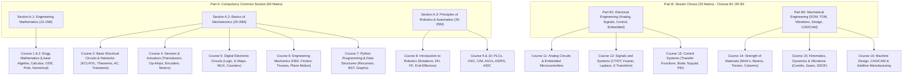

# NPTEL Master Course Guide & Syllabus Alignment: GATE 2027 RA

**Organizing Institute:** IIT Madras  
**Target:** 100% Complete GATE Robotics and Automation (RA) Syllabus Coverage  
**Focus:** Comprehensive Theoretical Foundations & High-Scoring Numerical / Problematic Mastery  

---

## 📌 Global Syllabus & Course Architecture Overview

```mermaid
graph TD
    subgraph Part_A_Compulsory ["Part A: Compulsory Common Section (60 Marks)"]
        A1["Section A.1: Engineering Mathematics (13-15M)"]
        A2["Section A.2: Basics of Mechatronics (25-30M)"]
        A3["Section A.3: Principles of Robotics & Automation (20-25M)"]
    end
    
    subgraph Part_B_Elective ["Part B: Stream Choice (25 Marks) - Choose B1 OR B2"]
        B1["Part B1: Electrical Engineering (Analog, Signals, Control, Embedded)"]
        B2["Part B2: Mechanical Engineering (SOM, TOM, Vibrations, Design, CAD/CAM)"]
    end
    
    A1 --> C_Math1["Course 1 & 2: Engg Mathematics (Linear Algebra, Calculus, ODE, Prob, Numerical)"]
    A2 --> C_Circuits["Course 3: Basic Electrical Circuits & Networks (KCL/KVL, Theorems, AC, Transients)"]
    A2 --> C_Sensors["Course 4: Sensors & Actuators (Transducers, Op-Amps, Encoders, Motors)"]
    A2 --> C_Digital["Course 5: Digital Electronic Circuits (Logic, K-Maps, MUX, Counters)"]
    A2 --> C_Mechanics["Course 6: Engineering Mechanics (FBD, Friction, Trusses, Plane Motion)"]
    A2 --> C_Python["Course 7: Python Programming & Data Structures (Recursion, BST, Graphs)"]
    A3 --> C_Robotics["Course 8: Introduction to Robotics (Rotations, DH, FK, End-Effectors)"]
    A3 --> C_Automation["Course 9 & 10: PLCs, CNC, CIM, AGVs, AS/RS, AIDC"]
    
    B1 --> C_Analog["Course 11: Analog Circuits & Embedded Microcontrollers"]
    B1 --> C_Signals["Course 12: Signals and Systems (CT/DT, Fourier, Laplace, Z-Transform)"]
    B1 --> C_Control["Course 13: Control Systems (Transfer Functions, Bode, Nyquist, PID)"]
    
    B2 --> C_SOM["Course 14: Strength of Materials (Mohr's, Beams, Torsion, Columns)"]
    B2 --> C_TOM["Course 15: Kinematics, Dynamics & Vibrations (Coriolis, Gears, SDOF)"]
    B2 --> C_Design["Course 16: Machine Design, CAD/CAM & Additive Manufacturing"]
```

---

# PART A: COMMON SECTION (COMPULSORY - 60 MARKS)

---

## SECTION A.1: ENGINEERING MATHEMATICS (13–15 MARKS)

### Course 1: *Engineering Mathematics I: Linear Algebra & Calculus*
* **Primary Instructor:** Prof. Jitendra Kumar (IIT Kharagpur) / Prof. K.C. Sivakumar (IIT Madras)
* **Direct Lecture Video:** [YouTube Video](https://www.youtube.com/watch?v=4QFsiXfgbzM)
* **Course Playlist:** [NPTEL Playlist](https://www.youtube.com/playlist?list=PLbRMhDVUMngeVrxtbBz-n8HvP8KAWBpI5)
* **Exact Syllabus Coverage:** Matrices, Transpose, Determinant, Rank, Eigenvalues & Eigenvectors, Trace, Adjoint, System of Linear Equations ($Ax = b$), Single & Multivariable Calculus, Mean Value Theorems, Taylor Series, Maxima/Minima, Double & Triple Integrals, Vector Calculus (Gradient, Divergence, Curl, Vector Identities).

#### 📖 Theoretical Foundations
1. **Linear Systems & Spaces:** Vector spaces, linear independence, basis, dimension, Rank-Nullity theorem ($\text{rank}(A) + \text{nullity}(A) = n$).
2. **Eigenvalues & Cayley-Hamilton:** Characteristic polynomial $\det(A - \lambda I) = 0$, every square matrix satisfies its own characteristic equation, algebraic vs geometric multiplicity, diagonalizability ($A = P D P^{-1}$).
3. **Multivariable Calculus:** Continuity, directional derivative along unit vector $\hat{u}$ ($D_u f = \nabla f \cdot \hat{u}$), Hessian matrix test for local extrema and saddle points.
4. **Vector Field Theorems:** Physical meaning of $\nabla \cdot \vec{V}$ (flux density / compressibility) and $\nabla \times \vec{V}$ (circulation / vorticity). Green's theorem, Gauss divergence theorem, and Stokes' curl theorem.

#### 🧮 Problematic & Numerical Mastery (High-Yield Problem Types)
* **Problem Type 1 [Rank & System Consistency]:** Determine conditions on parameters $a, b$ for $Ax = b$ to have unique, infinite, or no solutions using augmented matrix row echelon form $[A | b]$.
* **Problem Type 2 [Eigenvalues & Trace/Det]:** Fast properties: $\sum \lambda_i = \text{Trace}(A)$, $\prod \lambda_i = \det(A)$. Eigenvalues of $A^k$, $A^{-1}$, and $(A + cI)$.
* **Problem Type 3 [Maxima/Minima of Two Variables]:** Evaluate $D = f_{xx} f_{yy} - (f_{xy})^2$. If $D > 0$ and $f_{xx} > 0 \implies$ local min; if $D > 0$ and $f_{xx} < 0 \implies$ local max; if $D < 0 \implies$ saddle point.
* **Problem Type 4 [Vector Surface/Volume Integrals]:** Apply Gauss divergence theorem $\iint_S \vec{F} \cdot \hat{n} \, dS = \iiint_V (\nabla \cdot \vec{F}) \, dV$ to rapidly evaluate closed surface integrals in 30 seconds.

---

### Course 2: *Differential Equations, Probability & Numerical Methods*
* **Primary Instructors:** Prof. Somesh Kumar (IIT Kharagpur) & Prof. D.N. Pandey (IIT Roorkee)
* **Direct Lecture Video:** [YouTube Video](https://www.youtube.com/watch?v=VVYLpmKRfQ8)
* **Course Playlist:** [NPTEL Playlist](https://www.youtube.com/playlist?list=PL6C92B335BD4238AB)
* **Exact Syllabus Coverage:** 1st Order Linear & Nonlinear ODEs, Higher-Order Linear ODEs with constant coefficients, Euler-Cauchy equations, Laplace Transforms, Heat/Wave/Laplace equations, Fourier Series; Probability axioms, Conditional probability, Random variables, Expectation, Binomial, Poisson, Normal distributions, Hypothesis testing, PDF & CDF; Numerical Methods (Newton-Raphson, Trapezoidal & Simpson's rules, Euler's, RK4).

#### 📖 Theoretical Foundations
1. **Differential Equations:** Integrating factors $\mu(x) = e^{\int P dx}$, complementary function (roots of auxiliary equation: real, repeated, complex) + particular integral using operator $1/f(D)$. Euler-Cauchy substitution $x = e^z, x \frac{d}{dx} = D$.
2. **Probability Theory:** Kolmogorov axioms, Bayes' theorem $P(A_i|B) = \frac{P(B|A_i)P(A_i)}{\sum P(B|A_j)P(A_j)}$, expectation $E[g(X)]$, variance $\text{Var}(X) = E[X^2] - (E[X])^2$.
3. **Standard Distributions:**
   - Binomial: $P(X=k) = \binom{n}{k} p^k (1-p)^{n-k}$, mean $= np$, variance $= np(1-p)$.
   - Poisson: $P(X=k) = \frac{e^{-\lambda} \lambda^k}{k!}$, mean $=$ variance $= \lambda$.
   - Normal: Standard normal variable $Z = \frac{X - \mu}{\sigma}$, symmetry around $Z = 0$.
4. **Numerical Methods:** Order of convergence (Newton-Raphson quadratic $p = 2$, Secant $p = 1.618$), error bounds in numerical quadrature.

#### 🧮 Problematic & Numerical Mastery (High-Yield Problem Types)
* **Problem Type 1 [Initial Value Problems via Laplace]:** Solving $\ddot{y} + a\dot{y} + b y = f(t)$ with $y(0), \dot{y}(0)$ using $\mathcal{L}\{\dot{y}\} = s Y(s) - y(0)$ and partial fraction expansion.
* **Problem Type 2 [Poisson & Normal Distribution Numericals]:** Evaluating probabilities for rare events (Poisson arrivals) and converting Gaussian limits to standard normal $Z$-scores using error function tables.
* **Problem Type 3 [Newton-Raphson Iteration]:** Recurrence formula $x_{n+1} = x_n - \frac{f(x_n)}{f'(x_n)}$. Calculate $x_1, x_2$ starting from initial guess $x_0$.
* **Problem Type 4 [Simpson's 1/3 and 3/8 Rules]:**
  - Trapezoidal: $\int_a^b f(x)dx \approx \frac{h}{2} [y_0 + 2(y_1 + \dots + y_{n-1}) + y_n]$ (Error $\propto h^2$).
  - Simpson's 1/3: $\frac{h}{3} [y_0 + 4(y_{\text{odd}}) + 2(y_{\text{even}}) + y_n]$ (requires even number of intervals, Error $\propto h^4$).

---

## SECTION A.2: BASICS OF MECHATRONICS (25–30 MARKS)

### Course 3: *Basic Electrical Circuits & Network Analysis* — **[HIGH-PRIORITY CRITICAL COURSE]**
* **Primary Instructor:** Prof. Nagendra Krishnapura (IIT Madras) / Prof. Tapas Kumar Bhattacharya (IIT Kharagpur)
* **Direct Lecture Video:** [YouTube Video](https://www.youtube.com/watch?v=ZnXau5GhgGI)
* **Course Playlist:** [NPTEL Playlist](https://www.youtube.com/playlist?list=PLa4KQhDlGd7QCTX3gTz0LyoL93jVjtaMe)
* **Exact Syllabus Coverage:** Ideal voltage and current sources, dependent sources (VCVS, VCCS, CCVS, CCCS), R, L, C, M elements; Network solution methods: Kirchhoff's laws (KCL, KVL), Node and Mesh analysis; Network Theorems: Thevenin's, Norton's, Superposition and Maximum Power Transfer theorem; Transient response of DC and AC networks, sinusoidal steady-state analysis, resonance, two-port networks, balanced three-phase circuits, complex power and power factor in AC circuits.

#### 📖 Theoretical Foundations
1. **Kirchhoff's Laws & Graph Formulation:**
   - **KCL:** $\sum I_{\text{node}} = 0$ (Conservation of charge).
   - **KVL:** $\sum V_{\text{loop}} = 0$ (Conservation of energy).
   - Supernode formulation (when ideal voltage source connects two non-reference nodes).
   - Supermesh formulation (when current source lies between two adjacent meshes).
2. **Network Theorems:**
   - **Thevenin's Theorem:** Any linear two-terminal active network can be replaced by open-circuit voltage $V_{th}$ in series with equivalent resistance $R_{th}$.
   - **Norton's Theorem:** Replaced by short-circuit current $I_{sc}$ in parallel with $R_{th}$ ($V_{th} = I_{sc} \cdot R_{th}$).
   - **Maximum Power Transfer:** For DC, $R_L = R_{th} \implies P_{\max} = \frac{V_{th}^2}{4 R_{th}}$. For AC, load impedance must be the complex conjugate of source impedance: $Z_L = Z_{th}^*$.
   - **Superposition Theorem:** In a linear circuit with multiple independent sources, response is the algebraic sum of individual responses acting alone. (Dependent sources must NEVER be turned off!).
3. **Transients in DC & AC Networks:**
   - First-Order (RL): Current $i(t) = i(\infty) + [i(0^+) - i(\infty)] e^{-t/\tau}$, where time constant $\tau = L/R$.
   - First-Order (RC): Voltage $v(t) = v(\infty) + [v(0^+) - v(\infty)] e^{-t/\tau}$, where $\tau = R C$.
   - Continuity conditions at switching ($t = 0^-$ to $0^+$): Inductor current cannot change instantaneously ($i_L(0^+) = i_L(0^-)$); Capacitor voltage cannot change instantaneously ($v_C(0^+) = v_C(0^-)$).
   - Second-Order RLC: Damping factor $\alpha$ vs undamped resonant frequency $\omega_0 = 1/\sqrt{LC}$. Overdamped ($\alpha > \omega_0$), Critically damped ($\alpha = \omega_0$), Underdamped ($\alpha < \omega_0$).
4. **AC Steady-State & Three-Phase:**
   - Phasor domain: Inductive reactance $X_L = j \omega L$, Capacitive reactance $X_C = \frac{1}{j \omega C} = -j \frac{1}{\omega C}$.
   - Series Resonance: Impedance is purely resistive ($Z = R$), minimum impedance, maximum current, resonant frequency $\omega_0 = \frac{1}{\sqrt{LC}}$, Quality Factor $Q = \frac{\omega_0 L}{R} = \frac{1}{\omega_0 C R} = \frac{1}{R} \sqrt{\frac{L}{C}}$, Bandwidth $BW = \frac{\omega_0}{Q} = \frac{R}{L}$.
   - Two-Port Networks: Z-parameters, Y-parameters, ABCD-parameters, h-parameters. Reciprocity condition ($Z_{12} = Z_{21}, Y_{12} = Y_{21}, AD - BC = 1$), Symmetry condition ($Z_{11} = Z_{22}, Y_{11} = Y_{22}, A = D$).
   - Balanced Three-Phase: Star connection ($V_L = \sqrt{3} V_{ph}, I_L = I_{ph}$), Delta connection ($V_L = V_{ph}, I_L = \sqrt{3} I_{ph}$). Total complex power $S = \sqrt{3} V_L I_L \angle \phi = P + jQ$. Two-wattmeter method: $P = W_1 + W_2$, $\tan \phi = \sqrt{3} \frac{W_1 - W_2}{W_1 + W_2}$.

#### 🧮 Problematic & Numerical Mastery (High-Yield Problem Types)
* **Problem Type 1 [Node Analysis with Dependent Sources]:** Given a bridge circuit containing a diamond symbol (e.g., $2 V_x$ or $5 I_\Delta$), establish KCL matrix equation, express controlling variable in terms of node voltages, and solve for target current/voltage.
* **Problem Type 2 [Finding Thevenin Resistance with Dependent Sources]:** Deactivate all independent sources (short voltage sources, open current sources), connect a 1 V test source or 1 A test current at load terminals, calculate $I_{test}$ or $V_{test}$, and find $R_{th} = V_{test} / I_{test}$.
* **Problem Type 3 [Switching Transients & Initial Derivatives]:** A switch moves at $t = 0$. Determine $i_L(0^+), v_C(0^+)$, then write KVL/KCL at $t = 0^+$ to find the derivative rates $\left.\frac{di_L}{dt}\right|_{t=0^+}$ and $\left.\frac{dv_C}{dt}\right|_{t=0^+}$.
* **Problem Type 4 [AC Resonance & Bandwidth NATs]:** Given an RLC series tank with $R = 10 \, \Omega, L = 50 \, \text{mH}, C = 2 \, \mu\text{F}$, compute resonant frequency $\omega_0$ in rad/s, Quality factor $Q$, and half-power cutoff frequencies $\omega_1, \omega_2 = \omega_0 \pm \frac{BW}{2}$.
* **Problem Type 5 [Two-Wattmeter Power Calculation]:** Two wattmeters read $W_1 = 12 \, \text{kW}$ and $W_2 = -4 \, \text{kW}$. Compute total real power ($P = 12 - 4 = 8 \, \text{kW}$), load power factor angle $\phi = \arctan\left(\sqrt{3} \frac{12 - (-4)}{12 + (-4)}\right)$, and power factor $\cos \phi$.

---

### Course 4: *Sensors and Signal Conditioning*
* **Primary Instructor:** Prof. Hardik J. Pandya (IISc Bangalore)
* **Direct Lecture Video:** [YouTube Video](https://www.youtube.com/watch?v=nE1C4ghfvac)
* **Course Playlist:** [NPTEL Playlist](https://www.youtube.com/playlist?list=PLgMDNELGJ1CbufZjqWa8uoSlQWKqVwPN7)
* **Exact Syllabus Coverage:** Resistive, Capacitive, Inductive, Piezoelectric, Hall Effect sensors and associated signal conditioning circuits; Transducers for industrial instrumentation: displacement (linear and angular), velocity, acceleration, force, torque, pressure.

#### 📖 Theoretical Foundations
1. **Piezoresistive & Strain Sensors:** Gauge Factor derivation $GF = \frac{\Delta R / R}{\varepsilon} = 1 + 2\nu + \frac{\Delta \rho / \rho}{\varepsilon}$ ($\nu$ is Poisson's ratio). RTD Pt100 ($R_T = R_0(1 + \alpha T)$), NTC thermistor ($\beta$-parameter equation $R_T = R_0 e^{\beta(1/T - 1/T_0)}$).
2. **Inductive & Capacitive Transducers:** LVDT (Linear Variable Differential Transformer) secondary differential connection $V_0 = V_{s1} - V_{s2}$; residual null voltage due to harmonics and stray capacitance; phase-sensitive demodulation. Capacitive displacement sensors: variable plate separation ($C \propto 1/x$), variable area ($C \propto A$), variable permittivity.
3. **Piezoelectric & Hall Sensors:** Direct piezoelectric effect ($q = d \cdot F$), voltage sensitivity $g = d / \varepsilon$. Equivalent electrical circuit (charge generator in parallel with capacitance $C_p$ and leakage resistance $R_p$). Why it cannot measure DC static force (charge leakage decay). Hall Effect: $V_H = \frac{R_H I B}{t}$, where $R_H = 1/(n q)$ is Hall coefficient.
4. **Signal Conditioning:** Wheatstone bridge deflection voltage for 1/4 bridge ($V_0 = \frac{V_s}{4} GF \varepsilon$), half bridge ($V_0 = \frac{V_s}{2} GF \varepsilon$), and full bridge ($V_0 = V_s GF \varepsilon$); 3-Op-Amp Instrumentation Amplifier: CMRR, high input impedance, Differential Gain $A_d = \left(1 + \frac{2 R_1}{R_{\text{gain}}}\right) \frac{R_3}{R_2}$.

#### 🧮 Problematic & Numerical Mastery (High-Yield Problem Types)
* **Problem Type 1 [Wheatstone Bridge Output Voltage]:** Full-bridge strain gauge load cell with $GF = 2.1$, excitation $V_s = 10 \, \text{V}$, strain $\varepsilon = 800 \, \mu\text{strain}$. Calculate output voltage $V_0 = 10 \times 2.1 \times (800 \times 10^{-6}) = 16.8 \, \text{mV}$.
* **Problem Type 2 [Instrumentation Amplifier Gain]:** Design gain $A_v = 500$ with $R_1 = 50 \, \text{k}\Omega, R_3/R_2 = 5$. Calculate potentiometer resistor $R_{\text{gain}}$.
* **Problem Type 3 [Hall Voltage & Magnetic Flux]:** Semiconductor wafer with thickness $t = 0.5 \, \text{mm}$, current $I = 20 \, \text{mA}$, field $B = 0.4 \, \text{T}$, Hall coefficient $R_H = 3.5 \times 10^{-3} \, \text{m}^3/\text{C}$. Find $V_H = \frac{R_H I B}{t}$.
* **Problem Type 4 [Piezoelectric Low-Frequency Cutoff]:** Transducer with $C = 1200 \, \text{pF}$, cable capacitance $C_c = 300 \, \text{pF}$, load resistance $R_L = 10 \, \text{M}\Omega$. Compute 3 dB cutoff frequency $f_c = \frac{1}{2 \pi R_L (C + C_c)}$.

---

### Course 5: *Digital Electronic Circuits*
* **Primary Instructor:** Prof. Goutam Saha (IIT Kharagpur)
* **Direct Lecture Video:** [YouTube Video](https://www.youtube.com/watch?v=oNh6V91zdPY)
* **Course Playlist:** [NPTEL Playlist](https://www.youtube.com/playlist?list=PLbRMhDVUMnge4gDT0vBWjCb3Lz0HnYKkX)
* **Exact Syllabus Coverage:** Boolean algebra, combinational circuits (multiplexers, encoders, decoders), and sequential circuits (flip-flops, counters).

#### 📖 Theoretical Foundations
1. **Boolean Logic & Minimization:** De Morgan's theorems, standard Sum-of-Products (SOP) and Product-of-Sums (POS), 3 and 4-variable Karnaugh Maps (K-Maps), essential prime implicants, don't-care conditions ($X$).
2. **Combinational Building Blocks:** Multiplexers ($2^n : 1$ MUX) as universal logic synthesizers; Encoders and Priority Encoders (resolving simultaneous active inputs); Decoders ($n : 2^n$) with active-low enables.
3. **Sequential Logic:** Latches vs Edge-Triggered Flip-Flops (SR, JK, D, T). JK race-around condition when $J=K=1$ and pulse width $t_p > t_{pd}$; Master-Slave configuration solution; Characteristic equations:
   - D Flip-Flop: $Q_{next} = D$
   - T Flip-Flop: $Q_{next} = T \oplus Q$
   - JK Flip-Flop: $Q_{next} = J \bar{Q} + \bar{K} Q$
4. **Counters:** Asynchronous (Ripple) vs Synchronous counters. Modulus $N$ counters ($2^{n-1} < N \le 2^n$), propagation delay accumulation in ripple counters ($t_{\text{total}} = n \cdot t_{pd}$).

#### 🧮 Problematic & Numerical Mastery (High-Yield Problem Types)
* **Problem Type 1 [Boolean Function via 4:1 / 8:1 MUX]:** Implement 3-variable or 4-variable functions using an 8:1 or 4:1 multiplexer by connecting variables to select lines and finding input channel values ($0, 1, C, \bar{C}$).
* **Problem Type 2 [Synchronous Counter Design with JK/T Flip-Flops]:** Given state sequence $00 \to 10 \to 11 \to 01 \to 00$, use excitation tables to find expressions for $J_A, K_A, J_B, K_B$.
* **Problem Type 3 [Ripple Counter Max Operating Frequency]:** 4-bit ripple counter where each flip-flop has $t_{pd} = 25 \, \text{ns}$. Calculate max clock frequency $f_{\max} = \frac{1}{4 \times 25 \times 10^{-9}} = 10 \, \text{MHz}$.

---

### Course 6: *Engineering Mechanics for Robotics* — **[HIGH-PRIORITY CRITICAL COURSE]**
* **Primary Instructor:** Prof. Manoj K. Harbola (IIT Kanpur) / Prof. K. Ramesh (IIT Madras)
* **Direct Lecture Video:** [YouTube Video](https://www.youtube.com/watch?v=LG0YzGeAFxk)
* **Course Playlist:** [NPTEL Playlist](https://www.youtube.com/playlist?list=PL3D71089119256E1E)
* **Exact Syllabus Coverage:** Free-body diagrams and equilibrium; friction and its applications: rolling friction, belt-pulley; trusses and frames; kinematics and dynamics of rigid bodies in plane motion.

#### 📖 Theoretical Foundations
1. **Statics & Free-Body Diagrams (FBD):** Conditions of static equilibrium in 2D ($\sum F_x = 0, \sum F_y = 0, \sum M_O = 0$). Lami's theorem for three concurrent coplanar forces: $\frac{F_1}{\sin \alpha} = \frac{F_2}{\sin \beta} = \frac{F_3}{\sin \gamma}$.
2. **Friction Phenomena:** Coulomb dry friction laws, angle of friction $\tan \phi = \mu$, angle of repose. Rolling resistance coefficient ($F_r = \mu_r N / R$). Flat & V-Belt pulley friction: limiting tension ratio $\frac{T_1}{T_2} = e^{\mu \theta}$ (for V-belt: $\frac{T_1}{T_2} = e^{\mu \theta / \sin(\beta/2)}$), centrifugal tension compensation $T_c = m v^2$.
3. **Trusses & Pin-Jointed Frames:** Method of Joints (concurrent force equilibrium at individual pins) and Method of Sections (cutting members to find internal axial forces); Rules for identifying zero-force members.
4. **Kinematics & Dynamics in Plane Motion:**
   - Velocity analysis using Instantaneous Centre of Zero Velocity (I-centre).
   - D'Alembert's principle (converting dynamic equations to dynamic equilibrium by adding inertia force $-m a_{cm}$ and inertia torque $-I_{cm} \alpha$).
   - Work-Energy theorem ($W_{1\to 2} = \Delta KE_{\text{trans}} + \Delta KE_{\text{rot}}$).
   - Conservation of angular momentum about fixed point or center of mass ($\sum \tau_{cm} = I_{cm} \alpha$).

#### 🧮 Problematic & Numerical Mastery (High-Yield Problem Types)
* **Problem Type 1 [Belt-Pulley Power Transmission]:** Belt passes over pulley with angle of wrap $\theta = 150^\circ = 150 \times \pi / 180 = 2.618 \, \text{rad}$, $\mu = 0.3$, belt speed $v = 15 \, \text{m/s}$, maximum tension $T_1 = 1500 \, \text{N}$, belt mass $m = 0.8 \, \text{kg/m}$. Compute centrifugal tension $T_c = m v^2 = 0.8 \times 15^2 = 180 \, \text{N}$, effective tension $(T_1 - T_c)$, slack side tension $T_2$, and maximum transmissible power $P = (T_1 - T_2) v$.
* **Problem Type 2 [Zero-Force Member Identification in Trusses]:** Inspect truss joints where two non-collinear members meet with no external load, or where three members meet with two collinear and no load on third.
* **Problem Type 3 [Rigid Body Rolling Without Slipping]:** A solid cylinder of mass $m$ and radius $R$ ($I = \frac{1}{2} m R^2$) rolls down an incline $\theta$. Compute acceleration $a = \frac{g \sin \theta}{1 + I/(m R^2)} = \frac{2}{3} g \sin \theta$ and minimum required friction coefficient $\mu_{\min} = \frac{1}{3} \tan \theta$.
* **Problem Type 4 [Instantaneous Center (I-centre) Velocity]:** Locate I-centre of a moving link (e.g., ladder sliding against vertical wall and horizontal floor) to find angular velocity $\omega$ and linear velocity of midpoint in 2 steps.

---

### Course 7: *Programming and Data Structures Using Python*
* **Primary Instructor:** Prof. Madhavan Mukund (Chennai Mathematical Institute / NPTEL)
* **Direct Lecture Video:** [YouTube Video](https://www.youtube.com/watch?v=9MmC_uGjBsM)
* **Course Playlist:** [NPTEL Playlist](https://www.youtube.com/playlist?list=PLyqSpQzTE6M_Fu6l8irVwXkUyC9Gwqr6_)
* **Exact Syllabus Coverage:** Flowcharts and pseudocode; Programming in Python: data types, operators, expressions, conditionals (`if`, `elif`, `else`, `case`), looping (`while`, `for`, `break`, `continue`), functions, arrays, dictionaries, strings, recursion; Data Structures: Stack, Queue, Linked List, Binary Search Tree (BST), Binary Heap, Graph.

#### 📖 Theoretical Foundations
1. **Python Mechanics:** Dynamic typing, immutable types (int, float, tuple, str) vs mutable types (list, dict, set), slicing syntax `list[start:stop:step]`, list comprehensions, recursion stack trace and call frames.
2. **Algorithm Complexity:** Asymptotic notation ($O, \Omega, \Theta$), recurrence relations (Master Theorem $T(n) = a T(n/b) + f(n)$), recursive call tree depth.
3. **Linear Data Structures:**
   - Stack: LIFO (Last-In-First-Out), infix-to-postfix conversion, parenthesis matching.
   - Queue / Deque: FIFO (First-In-First-Out), circular buffer modulo arithmetic.
   - Linked List: Pointer rewiring during insertion, deletion, and reversal ($O(1)$ head insertion vs $O(n)$ search).
4. **Non-Linear Data Structures:**
   - Binary Search Tree (BST): Left child $<$ Node $<$ Right child; Inorder traversal always yields strictly sorted keys; Best case $O(\log n)$, Worst case (skewed) $O(n)$.
   - Binary Heap: Complete binary tree representation in array (children of index $i$ at $2i+1, 2i+2$, parent at $\lfloor(i-1)/2\rfloor$). Min-heap property ($A[\text{parent}] \le A[\text{child}]$). Build-heap in $O(n)$, extract-min in $O(\log n)$.
   - Graphs: Adjacency Matrix vs Adjacency List; Breadth-First Search (BFS, queue-based, finds shortest unweighted path); Depth-First Search (DFS, stack/recursion based, topological sort and cycle detection).

#### 🧮 Problematic & Numerical Mastery (High-Yield Problem Types)
* **Problem Type 1 [Trace Recursive Python Code]:** Given complex recursive functions with nested returns or memoization, determine the exact return value for a specific input argument.
* **Problem Type 2 [BST Traversal Reconstruction]:** Given preorder sequence $[50, 30, 20, 40, 70, 60, 80]$ and knowing inorder is sorted $[20, 30, 40, 50, 60, 70, 80]$, construct tree and output postorder traversal.
* **Problem Type 3 [Binary Heap Operations]:** Insert sequence $[12, 5, 8, 2, 14, 1]$ into an initially empty min-heap and determine the array contents after two `extract_min()` operations.
* **Problem Type 4 [Graph BFS/DFS Order & Shortest Path]:** Given an adjacency list, trace queue contents in BFS starting from vertex $V_0$ to find distance array $d[v]$.

---

## SECTION A.3: PRINCIPLES OF ROBOTICS AND AUTOMATION (20–25 MARKS)

### Course 8: *Introduction to Robotics*
* **Primary Instructors:** Prof. Ashish Dutta (IIT Kanpur) & Prof. T. Asokan (IIT Madras)
* **Direct Lecture Video:** [YouTube Video](https://www.youtube.com/watch?v=j0kmlMDcObE)
* **Course Playlist:** [NPTEL Playlist](https://www.youtube.com/playlist?list=PLFW6lRTa1g81AGUOky_xVhNVsudGwZxsY)
* **Exact Syllabus Coverage:** Robotic classification: serial and parallel manipulators, geometrical configuration, links and joints, coordinate systems, degrees-of-freedom; Rotation matrices in 2D and 3D; homogeneous transformations, forward kinematics; Robot applications: point-to-point and continuous path control, types of end-effectors, robot accuracy and repeatability.

#### 📖 Theoretical Foundations
1. **Robotic Classification & Work Volume:** Serial vs Parallel (Stewart platform) arms; Cartesian (PPP), Cylindrical (RPP), Spherical (RRP), SCARA (RRP with vertical axis), Articulated/Anthropomorphic (RRR). Grübler / Kutzbach mobility criterion: $DOF = \lambda(n - j - 1) + \sum f_i$ ($\lambda = 6$ for spatial, 3 for planar).
2. **Spatial Coordinate Transformations:**
   - 3D Rotation matrices $R \in SO(3)$: Orthogonality ($R^T = R^{-1}, \det R = +1$).
   - Elementary rotations $R_x(\alpha), R_y(\beta), R_z(\gamma)$.
   - Composite rotations: Pre-multiplication (fixed base frame) vs Post-multiplication (current moving frame).
   - Rotation angle shortcut from trace: $\text{Trace}(R) = 1 + 2 \cos \theta \implies \theta = \arccos\left(\frac{\text{Trace}(R) - 1}{2}\right)$.
3. **Denavit-Hartenberg (D-H) Parametric Formulation:**
   - The 4 link parameters: Joint angle $\theta_i$, Link offset $d_i$, Link length $a_i$, Link twist $\alpha_i$.
   - Common normal axis $X_i$ perpendicular to joint axes $Z_{i-1}$ and $Z_i$.
   - Forward transformation matrix $A_i = \text{Rot}_{Z}(\theta_i) \text{Trans}_{Z}(d_i) \text{Trans}_{X}(a_i) \text{Rot}_{X}(\alpha_i)$.
4. **End-Effectors & Motion Profiles:** Mechanical pinch grippers, vacuum suction cups (sizing $F = P \cdot A \cdot S_f$), magnetic and adhesive grippers. Point-to-Point (PTP) trajectory generation using cubic polynomials ($q(t) = a_0 + a_1 t + a_2 t^2 + a_3 t^3$) and trapezoidal velocity profiles; Continuous Path (CP) tracking. Definition of Spatial Resolution, Repeatability (radius of sphere of returning points), and Accuracy (deviation from programmed target).

#### 🧮 Problematic & Numerical Mastery (High-Yield Problem Types)
* **Problem Type 1 [2D & 3D Homogeneous Transformation Matrix NAT]:** A point $P = [1, 2, 3]^T$ in frame $B$ is translated by $[4, -2, 1]^T$ and rotated about $Z$ by $90^\circ$ relative to frame $A$. Compute coordinates $^{A}P = \, ^{A}T_B \cdot \, ^{B}P$.
* **Problem Type 2 [DH Parameter Derivation for 2R/3R Arms]:** Given arm geometry, formulate the DH table and compute end-effector position coordinates $x, y$ in terms of joint angles $\theta_1, \theta_2$.
* **Problem Type 3 [Vacuum Gripper Payload Sizing]:** A vacuum gripper handles a 25 kg steel plate with 4 suction cups, coefficient of friction $\mu = 0.4$, safety factor $S_f = 2$, and vacuum negative pressure of $P = 60 \, \text{kPa}$. Calculate required cup diameter $D$.
* **Problem Type 4 [Cubic Polynomial Trajectory NAT]:** Robot moves from $\theta(0) = 10^\circ$ to $\theta(2) = 70^\circ$ in 2 seconds with zero initial and final velocity. Find velocity and acceleration at $t = 1.0 \, \text{s}$.

---

### Course 9 & 10: *Industrial Automation, PLCs & CIM*
* **Primary Instructors:** Prof. Siddhartha Mukhopadhyay (IIT Kharagpur) & Prof. Shrikrishna N. Joshi (IIT Guwahati)
* **Direct Lecture Video:** [YouTube Video](https://www.youtube.com/watch?v=oxMdDsud5vg) | [CIM Video](https://www.youtube.com/watch?v=v-3TmN4HhLc)
* **Course Playlists:** [Automation Playlist](https://www.youtube.com/playlist?list=PLE8F9BF5CB1201D23) | [CIM Playlist](https://www.youtube.com/playlist?list=PLwdnzlV3ogoW31clPN6Dn6c8Ia-n36vXk)
* **Exact Syllabus Coverage:** CIM: Automation in Manufacturing, PLCs in manufacturing, Automated material handling systems, Automated storage and retrieval systems (AS/RS), Automated identification, detection and capture systems (AIDC); Computer numerical control (CNC); Single and multi-axis positioning systems; Concurrent design and manufacturing planning. Actuators: Hydraulic and pneumatic actuators, DC motors, stepper motors, servo motors.

#### 📖 Theoretical Foundations
1. **PLC Architecture & Ladder Logic:** CPU scan cycle (Input Scan $\to$ Logic Execution $\to$ Output Update $\to$ Overhead). NO/NC contacts, seal-in circuits (start/stop latch), Timer On-Delay (TON), Timer Off-Delay (TOF), Up/Down Counters (CTU/CTD).
2. **Fluid Power & Electric Actuators:**
   - Hydraulic & Pneumatic Cylinders: Single vs Double acting; Direction control valves (3/2, 4/2, 5/2 DCVs); Pressure relief valves; Cylinder extension force $F_{\text{ext}} = P \cdot A_{\text{piston}}$, retraction force $F_{\text{ret}} = P \cdot (A_{\text{piston}} - A_{\text{rod}})$, extension speed $v = Q / A$.
   - Stepper Motors: Variable reluctance vs Permanent Magnet vs Hybrid stepper; Step angle $\beta = \frac{360^\circ}{m \cdot N_r}$, microstepping.
   - DC & Servo Motors: Back-EMF $E_b = K_e \omega$, Torque $T = K_t I_a$, linear torque-speed droop $\omega = \frac{V}{K_e} - \frac{R_a}{K_e K_t} T$.
3. **CIM, AS/RS, AGVs & AIDC:**
   - AS/RS Travel Time: Single-command cycle $T_{sc} = 2 \max\left(\frac{L}{v_x}, \frac{H}{v_y}\right) + 2 T_{pd}$; Dual-command cycle $T_{dc}$.
   - Automated Guided Vehicles (AGVs): Guidepath technologies (inductive wire, magnetic tape, laser triangulation, SLAM); Delivery cycle time and fleet sizing: $N_c = \frac{\text{Total Delivery Workload}}{\text{Available Time per Vehicle}}$.
   - Auto-ID Data Capture (AIDC): 1D Barcodes, 2D QR codes (Reed-Solomon error correction), RFID Transponders (Passive: backscatter coupling, no battery; Active: onboard battery, long range).
   - CNC Positioning: Open-loop stepper vs Closed-loop servo with rotary encoder feedback; Basic Length Unit (BLU) calculation.

#### 🧮 Problematic & Numerical Mastery (High-Yield Problem Types)
* **Problem Type 1 [Hydraulic Cylinder Force & Speed Ratio]:** Piston diameter $D = 80 \, \text{mm}$, rod diameter $d = 35 \, \text{mm}$, pump flow $Q = 40 \, \text{L/min}$, pressure $P = 15 \, \text{MPa}$. Find ratio of retraction force to extension force, and speed of extension.
* **Problem Type 2 [AS/RS Throughput & Travel Time Calculation]:** Rack length $L = 60 \, \text{m}$, height $H = 20 \, \text{m}$, crane speed $v_x = 2.0 \, \text{m/s}, v_y = 0.5 \, \text{m/s}$, pickup/deposit time $T_{pd} = 15 \, \text{s}$. Compute mean single-command travel time under Chebyshev metric.
* **Problem Type 3 [CNC Lead Screw BLU & Pulse Frequency]:** A lead screw pitch $p = 5 \, \text{mm}$ is driven by a stepper motor with 200 steps/rev connected via a 2:1 reduction gear. Compute Basic Length Unit (BLU in $\mu\text{m}$) and pulse rate required to feed at $600 \, \text{mm/min}$.
* **Problem Type 4 [PLC Ladder Logic Timing Diagram]:** Given a rung with TON timer and NC contacts, determine the output state after 5 seconds of button press.

---

# PART B: STREAM CHOICE (ELECTIVE - 25 MARKS)
*(Candidate chooses EITHER Part B1 OR Part B2)*

---

## PART B1: ELECTRICAL ENGINEERING STREAM

### Course 11: *Control Systems & Robot Control*
* **Primary Instructor:** Prof. Ramkrishna Pasumarthy (IIT Madras) / Prof. Madan Gopal (IIT Delhi)
* **Direct Lecture Video:** [YouTube Video](https://www.youtube.com/watch?v=7LZSjgZz-Qw)
* **Course Playlist:** [NPTEL Playlist](https://www.youtube.com/playlist?list=PLxn52v8fxX5l5tGzU1NAxRDkgqxK0k5UZ)
* **Exact Syllabus Coverage:** Mathematical modeling, feedback principle, transfer function, block diagrams, signal flow graphs; Transient and steady-state analysis of LTI systems; Stability: Routh-Hurwitz, Nyquist criteria, Bode plots, Root Loci; Lag, Lead, Lead-Lag compensators; P, PI, PID controllers.

#### 📖 Theoretical Foundations & Problematic Mastery
* **Transfer Functions & SFG:** Mason's gain formula $P = \frac{\sum P_k \Delta_k}{\Delta}$.
* **Transient Specifications:** Standard 2nd order $G(s) = \frac{\omega_n^2}{s^2 + 2\zeta\omega_n s + \omega_n^2}$. Peak overshoot $\%MP = e^{-\pi\zeta/\sqrt{1-\zeta^2}} \times 100\%$, peak time $t_p = \frac{\pi}{\omega_d}$, settling time $t_s = \frac{4}{\zeta\omega_n}$ (2% tolerance).
* **Stability Criteria:** Routh array row of zeros (auxiliary equation for oscillatory roots); Root locus rules (asymptotes, centroid $\sigma_A = \frac{\sum p - \sum z}{n - m}$, breakaway points $\frac{dK}{ds} = 0$); Nyquist stability criterion $N = P - Z$ (encirclements of $-1 + j0$).
* **Compensators & PID:** Phase Lead (advances phase, increases bandwidth/speed, improves PM); Phase Lag (boosts low-frequency gain, reduces steady-state error); PID parameters ($K_p$ raises speed, $K_i$ eliminates steady-state offset, $K_d$ damps oscillations).

---

### Course 12: *Analog Circuits and Embedded Systems*
* **Primary Instructors:** Prof. Nagendra Krishnapura (IIT Madras) & Prof. Santanu Chattopadhyay (IIT Kharagpur)
* **Direct Lecture Video:** [YouTube Video](https://www.youtube.com/watch?v=weKHhXsBf4E)
* **Course Playlist:** [NPTEL Playlist](https://www.youtube.com/playlist?list=PLzN9G9-0qj-DN6PEn_bZ54TlVrAOn1RCg)
* **Exact Syllabus Coverage:** Analog filters (LPF, HPF, BPF, BRF), Amplifiers (biasing, small-signal equivalent, frequency response, feedback), Op-amps (characteristics & applications), Oscillators, 555 timers, Schmitt triggers, S/H circuits, ADC/DAC converters, SMPS; Microcontrollers (CPU, memory, I/O ports, timers, interrupts, interfacing, DAQ).

#### 📖 Theoretical Foundations & Problematic Mastery
* **Op-Amp Circuits:** Ideal virtual ground concept; Inverting ($A_v = -R_f/R_1$), Non-Inverting ($A_v = 1 + R_f/R_1$), Differentiator, Integrator ($V_0 = -\frac{1}{RC} \int V_{in} dt$), Active Butterworth filters.
* **555 Timers & Converters:** Astable frequency $f = \frac{1.44}{(R_A + 2 R_B) C}$; Schmitt trigger upper and lower trip points ($V_{UT}, V_{LT}$); ADC resolution $V_{LSB} = \frac{V_{ref}}{2^n}$, quantization noise $\frac{V_{LSB}}{\sqrt{12}}$, SAR vs Dual-Slope ADC speed/accuracy trade-off.
* **Embedded Interfacing:** Memory address decoding, interrupt vector tables, latency calculation, UART baud rate generation.

---

### Course 13: *Signals and Systems*
* **Primary Instructor:** Prof. V.M. Gadre (IIT Bombay)
* **Direct Lecture Video:** [YouTube Video](https://www.youtube.com/watch?v=0nZYen9w_eo)
* **Course Playlist:** [NPTEL Playlist](https://www.youtube.com/playlist?list=PLyqSpQzTE6M8KJ-XQ1m2vl3nd2ZUqKEN8)
* **Exact Syllabus Coverage:** CT & DT signals, shifting/scaling, LTI and causal systems, Fourier series of periodic signals, Shannon's sampling theorem, Fourier Transform, Laplace Transform, Z-Transform, RMS and average value calculations.

#### 📖 Theoretical Foundations & Problematic Mastery
* **LTI System Characterization:** Convolution integral $y(t) = x(t) * h(t) = \int_{-\infty}^{\infty} x(\tau) h(t - \tau) d\tau$; Causality condition ($h(t) = 0$ for $t < 0$), BIBO Stability ($\int_{-\infty}^{\infty} |h(t)| dt < \infty$).
* **Sampling & Transforms:** Shannon's sampling theorem $f_s \ge 2 f_{\max}$ (Nyquist rate); Laplace ROC must include $j\omega$-axis for Fourier transform to exist; Z-transform ROC of causal stable systems includes unit circle $|z| = 1$.
* **Waveform Calculations:** RMS value $V_{rms} = \sqrt{\frac{1}{T} \int_0^T v^2(t) dt}$, Average value $V_{avg} = \frac{1}{T} \int_0^T v(t) dt$.

---

## PART B2: MECHANICAL ENGINEERING STREAM

### Course 14: *Strength of Materials (SOM)*
* **Primary Instructor:** Prof. S.P. Harsha (IIT Roorkee)
* **Direct Lecture Video:** [YouTube Video](https://www.youtube.com/watch?v=GkFgysZC4Vc)
* **Course Playlist:** [NPTEL Playlist](https://www.youtube.com/playlist?list=PL27C4A6AEA552F9E6)
* **Exact Syllabus Coverage:** Stress & strain, elastic constants ($E, G, K, \nu$), Mohr's circle (plane stress & strain), thin cylinders, SFD & BMD, bending & shear stresses, shear centre, beam deflection, torsion of circular shafts, Euler's columns, Castigliano's theorems, thermal stresses, strain gauges & rosettes, material testing (UTM, hardness, impact).

#### 📖 Theoretical Foundations & Problematic Mastery
* **Mohr's Circle:** Center $\left(\frac{\sigma_x + \sigma_y}{2}, 0\right)$, Radius $R = \sqrt{\left(\frac{\sigma_x - \sigma_y}{2}\right)^2 + \tau_{xy}^2}$. Principal stresses $\sigma_{1,2} = \text{Center} \pm R$. Max in-plane shear $\tau_{\max} = R$.
* **Beams & Torsion:** Pure bending $\frac{M}{I} = \frac{\sigma}{y} = \frac{E}{R}$; Pure torsion $\frac{T}{J} = \frac{\tau}{r} = \frac{G \theta}{L}$, where $J = \frac{\pi d^4}{32}$ for solid shaft.
* **Columns & Buckling:** Euler's critical load $P_{cr} = \frac{\pi^2 E I}{L_e^2}$ (both ends hinged: $L_e = L$; one fixed, one free: $L_e = 2L$; both fixed: $L_e = L/2$; one fixed, one hinged: $L_e = L/\sqrt{2}$).
* **Strain Rosettes:** Rectangular $45^\circ$ rosette: $\varepsilon_x = \varepsilon_a, \varepsilon_y = \varepsilon_c, \gamma_{xy} = 2 \varepsilon_b - (\varepsilon_a + \varepsilon_c)$.

---

### Course 15: *Theory of Machines & Mechanical Vibrations*
* **Primary Instructors:** Prof. Anirvan Dasgupta & Prof. Dilip Kumar Pratihar (IIT Kharagpur) / Prof. Rajiv Tiwari (IIT Guwahati)
* **Direct Lecture Video:** [YouTube Video](https://www.youtube.com/watch?v=yDEJxYGAoso)
* **Course Playlist:** [NPTEL Playlist](https://www.youtube.com/playlist?list=PLbRMhDVUMngdCkMipemSKP_dCgZLLfOe8)
* **Exact Syllabus Coverage:** Displacement, velocity, and acceleration analysis of plane mechanisms; dynamic analysis of linkages; gears and gear trains; balancing of reciprocating and rotating masses; gyroscope; Vibrations: free and forced SDOF systems, damping, vibration isolation, resonance, critical speeds of shafts.

#### 📖 Theoretical Foundations & Problematic Mastery
* **Kinematics & Coriolis:** Coriolis acceleration $a^c = 2 \omega v_{\text{rel}}$ (occurs when a slider moves along a rotating link); Epicyclic gear trains tabular speed analysis ($y = \text{arm speed}, x = \text{sun gear relative speed}$).
* **Gyroscopic Couple:** $C = I \omega \omega_p$ (precession rate $\omega_p = \frac{\tau_{\text{applied}}}{I \omega}$).
* **Vibrations & Isolation:** SDOF equation $m \ddot{x} + c \dot{x} + k x = F_0 \sin(\omega t)$. Damping ratio $\zeta = \frac{c}{2 \sqrt{k m}}$, logarithmic decrement $\delta = \frac{2\pi\zeta}{\sqrt{1 - \zeta^2}} = \ln\left(\frac{x_1}{x_2}\right)$. Transmissibility $TR = \sqrt{\frac{1 + (2\zeta r)^2}{(1-r^2)^2 + (2\zeta r)^2}}$. Isolation is effective ($TR < 1$) strictly when frequency ratio $r = \frac{\omega}{\omega_n} > \sqrt{2} \approx 1.414$.
* **Whirling of Shafts:** Critical whirling speed coincides with natural lateral frequency $\omega_{cr} = \omega_n = \sqrt{k/m}$.

---

### Course 16: *Machine Design, CAD/CAM & Additive Manufacturing*
* **Primary Instructors:** Prof. B. Maiti (IIT Kharagpur) & Prof. J. Ramkumar (IIT Kanpur)
* **Direct Lecture Video:** [YouTube Video](https://www.youtube.com/watch?v=mzWMdZZaHwI)
* **Course Playlist:** [NPTEL Playlist](https://www.youtube.com/playlist?list=PL3D4EECEFAA99D9BE)
* **Exact Syllabus Coverage:** Design for static and dynamic loading; failure theories; fatigue strength and S-N diagram; design of machine elements: bolted, riveted, welded joints, shafts, rolling and sliding contact bearings, brakes and clutches, springs; CAD/CAM concepts and integration tools; additive manufacturing.

#### 📖 Theoretical Foundations & Problematic Mastery
* **Failure Theories:** Maximum Shear Stress / Tresca ($\tau_{\max} \le \frac{S_y}{2 N}$), Distortion Energy / Von Mises ($\sigma_v = \sqrt{\sigma_1^2 - \sigma_1 \sigma_2 + \sigma_2^2} \le \frac{S_y}{N}$).
* **Fatigue & S-N Diagram:** Endurance limit $S_e$, Goodman line $\frac{\sigma_a}{S_e} + \frac{\sigma_m}{S_{ut}} = \frac{1}{N}$, Soderberg line $\frac{\sigma_a}{S_e} + \frac{\sigma_m}{S_y} = \frac{1}{N}$.
* **Bearings & Springs:** Ball bearing rating life $L_{10} = \left(\frac{C}{P}\right)^3 \times 10^6$ revolutions (roller bearing exponent is $10/3$). Doubling load drops life to $1/8$. Helical springs: Wahl stress factor $K_w = \frac{4C-1}{4C-4} + \frac{0.615}{C}$ (spring index $C = D/d$). Deflection $\delta = \frac{8 P D^3 n}{G d^4}$.
* **CAD/CAM & Additive Mfg:** Solid modeling CSG (Boolean union, intersection, difference) and B-Rep. SLA 3D printing cure depth follows Beer-Lambert law $C_d = D_p \ln(E / E_c)$. FDM layer resolution and build orientation effect on anisotropic strength.

---

## 🚀 Rapid Action Plan: How to Study for Max Marks

1. **Phase 1: Compulsory High-Yield First (Weeks 1–8)**
   - Engineering Mathematics (Course 1 & 2) — 15 Marks guaranteed.
   - Electric Circuits & KCL/KVL (Course 3) + Sensors & Actuators (Course 4) — 20 Marks.
   - Core Robotics (Course 8) + PLCs & Automation (Course 9 & 10) — 20 Marks.
2. **Phase 2: Stream Mastery (Weeks 9–14)**
   - If Mechanical (B2): SOM (Course 14) + TOM/Vibrations (Course 15) + Machine Design (Course 16) — 25 Marks.
   - If Electrical (B1): Control Systems (Course 11) + Analog & Embedded (Course 12) + Signals (Course 13) — 25 Marks.
3. **Phase 3: 1,000+ Question Practice & Mock Tests (Weeks 15–20)**
   - Practice the 100-question banks in `07_Practice_Question_Bank/` across all 10 modules.
