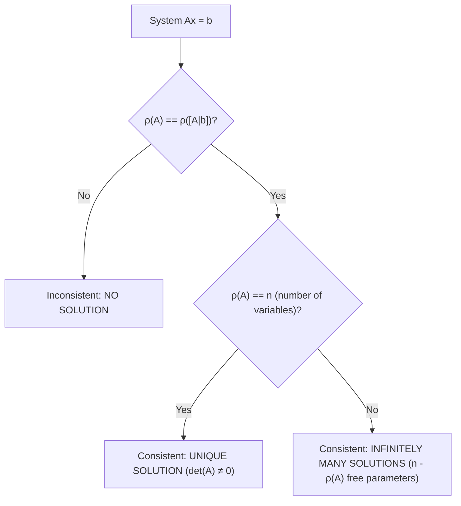

# Module 7: Linear Algebra & Matrix Transformations

**GATE Section:** Part A.1 (Engineering Mathematics)  
**Target:** Matrix Properties, Rank, Systems of Equations, Eigenvalues/Eigenvectors & SVD

---

## 1. Matrix Fundamentals & Determinants

### 1. Key Matrix Properties
* **Transpose:** $(AB)^T = B^T A^T$
* **Determinant:**
  * $\det(AB) = \det(A) \cdot \det(B)$
  * $\det(A^T) = \det(A)$
  * $\det(k A_{n \times n}) = k^n \det(A)$
  * $\det(A^{-1}) = \frac{1}{\det(A)}$
  * If two rows or columns are swapped, determinant changes sign ($\det = -\det$).
  * If any row/column is all zeros or a scalar multiple of another, $\det(A) = 0$.
* **Trace of a Matrix ($\text{tr}(A)$):**
  * $\text{tr}(A) = \sum_{i=1}^n a_{ii} = \sum_{i=1}^n \lambda_i$ (Sum of diagonal elements = Sum of eigenvalues).
  * $\text{tr}(AB) = \text{tr}(BA)$.
* **Inverse of a Matrix:**
  $$A^{-1} = \frac{\text{Adj}(A)}{\det(A)}, \quad \text{where } A \cdot \text{Adj}(A) = \det(A) \cdot I$$
  * $\det(\text{Adj}(A)) = (\det(A))^{n-1}$
  * $\text{Adj}(\text{Adj}(A)) = (\det(A))^{n-2} A$

---

## 2. Rank of a Matrix & Systems of Linear Equations ($Ax = b$)

### 1. Rank ($\rho(A)$)
* Number of non-zero rows in the row-echelon form of $A$.
* Maximum number of linearly independent row or column vectors.
* For matrix $A_{m \times n}$: $\rho(A) \le \min(m, n)$.

### 2. Consistency of Linear Equations ($A x = b$)
Let the augmented matrix be $[A | b]$:

### 3. Homogeneous System ($Ax = 0$)
* Always consistent since $x = 0$ (trivial zero solution) is always a solution.
* Has non-trivial (non-zero) solutions **if and only if $\det(A) = 0 \iff \rho(A) < n$**.

---

## 3. Eigenvalues & Eigenvectors

### 1. Characteristic Equation
$$\det(A - \lambda I) = 0$$
For an $n \times n$ matrix, this gives an $n^{\text{th}}$-degree polynomial whose roots are the eigenvalues $\lambda_1, \lambda_2, \dots, \lambda_n$.

### 2. Corresponding Eigenvector ($v$)
$$(A - \lambda_i I) v_i = 0$$

### 3. Essential Properties (High-Yield for GATE)
1. **Sum of Eigenvalues:** $\sum \lambda_i = \text{Trace}(A)$
2. **Product of Eigenvalues:** $\prod \lambda_i = \det(A)$
3. If $A$ has eigenvalues $\lambda_i$, then:
   * $A^k$ has eigenvalues $\lambda_i^k$
   * $A^{-1}$ has eigenvalues $1/\lambda_i$ (provided $\det(A) \neq 0$)
   * $A + cI$ has eigenvalues $\lambda_i + c$
   * $k A$ has eigenvalues $k \lambda_i$
4. **Symmetric Matrices ($A = A^T$):**
   * All eigenvalues are strictly **real numbers**.
   * Eigenvectors corresponding to distinct eigenvalues are **mutually orthogonal** ($v_i^T v_j = 0$).
5. **Skew-Symmetric Matrices ($A = -A^T$):**
   * All eigenvalues are either **purely imaginary or zero**.
6. **Orthogonal Matrices ($A^T A = I$, e.g. Rotation Matrices):**
   * Absolute value (modulus) of every eigenvalue is $|\lambda_i| = 1$.
   * Eigenvalues appear as $1, e^{j\theta}, e^{-j\theta}$ (where $\theta$ is the angle of rotation!).

### 4. Cayley-Hamilton Theorem
Every square matrix satisfies its own characteristic equation:
$$\text{If } \lambda^n + c_{n-1}\lambda^{n-1} + \dots + c_0 = 0 \implies A^n + c_{n-1}A^{n-1} + \dots + c_0 I = 0$$
* **Use in GATE:** Directly calculating $A^{-1}$ or higher powers $A^8, A^{100}$ in terms of lower degree matrices.

---

## 4. Singular Value Decomposition (SVD) for Robotics
Any real $m \times n$ matrix $A$ can be factored into:
$$A = U \Sigma V^T$$
Where:
- $U_{m \times m}$ is an orthogonal matrix of left singular vectors (eigenvectors of $A A^T$).
- $V_{n \times n}$ is an orthogonal matrix of right singular vectors (eigenvectors of $A^T A$).
- $\Sigma_{m \times n}$ is a diagonal matrix containing singular values $\sigma_i = \sqrt{\lambda_i(A^T A)}$ arranged in descending order ($\sigma_1 \ge \sigma_2 \ge \dots \ge 0$).
* **Robotics Application:** Manipulator manipulability ellipsoid, finding pseudoinverse of Jacobian $J^\dagger = V \Sigma^\dagger U^T$ near singularities!
