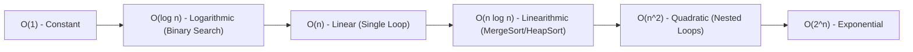

# Module 6: Python Programming & Data Structures for Robotics

**GATE Section:** Part A.2 (Basics of Mechatronics)  
**Target:** Fast-Track Python Essentials, Time Complexity & Data Structures for Mechanical Students

---

## 1. Python Essentials for GATE

### 1. Built-in Data Types & Mutability
| Data Type | Syntax | Mutable? | Indexing / Slicing | Unique Elements? |
| :--- | :--- | :---: | :---: | :---: |
| **`list`** | `[1, 2, "robot", 3.14]` | **Yes** | Yes (`arr[0]`, `arr[1:4]`) | No (allows duplicates) |
| **`tuple`** | `(1, 2, "fixed")` | **No** (Immutable) | Yes (`tup[0]`) | No |
| **`dict`** | `{"dof": 6, "type": "SCARA"}` | **Yes** | By key (`d["dof"]`) | Keys must be unique & hashable |
| **`set`** | `{1, 2, 3, 3} -> {1, 2, 3}` | **Yes** | No | **Yes** (removes duplicates) |
| **`str`** | `"Robotics"` | **No** (Immutable) | Yes (`s[::-1]` reverses) | No |

---

### 2. Common Python Slicing & Operations Tricks
```python
s = "ROBOTICS"
print(s[1:4])      # Output: "OBO" (Indices 1, 2, 3)
print(s[::-1])     # Output: "SCITOBOR" (Reversed string)
print(s[::2])      # Output: "RBTI" (Step of 2)

# List Comprehension (Very common in GATE questions)
squares = [x**2 for x in range(5) if x % 2 == 0]
# Output: [0, 4, 16] (x = 0, 2, 4)
```

---

### 3. Scope & Recursion in Python
```python
# Factorial Recursion: T(n) = T(n-1) + O(1) -> O(n)
def factorial(n):
    if n <= 1:
        return 1
    return n * factorial(n - 1)

# Fibonacci Recursion: T(n) = T(n-1) + T(n-2) + O(1) -> O(2^n) time complexity!
def fib(n):
    if n <= 1:
        return n
    return fib(n - 1) + fib(n - 2)
```

---

## 2. Asymptotic Time & Space Complexities (Big-$O$)



---

## 3. Data Structures Breakdown

### 1. Stacks (LIFO - Last In First Out)
* **Key Operations:**
  * `push(x)`: Inserts element on top — $O(1)$
  * `pop()`: Removes and returns top element — $O(1)$
  * `peek()`: Inspects top element — $O(1)$
* **Applications in Robotics:** Undo operations, evaluation of arithmetic postfix expressions, Backtracking in maze solving / pathfinding.

---

### 2. Queues (FIFO - First In First Out)
* **Key Operations:**
  * `enqueue(x)`: Insert at rear — $O(1)$
  * `dequeue()`: Remove from front — $O(1)$
* **Varieties:** Circular Queue, Priority Queue (Min-Heap based), Deque (Double-ended queue).
* **Applications:** Sensor packet buffering, Breadth-First Search (BFS) in robot path planning.

---

### 3. Linked Lists
* **Nodes:** Each node contains `data` and a pointer/reference `next`.
* **Comparison with Arrays:**
  * Array: $O(1)$ random access, but resizing and mid-insertions are $O(n)$.
  * Linked List: $O(n)$ access time, but insertion/deletion at known node pointer is $O(1)$.

---

### 4. Binary Search Trees (BST)
* **Property:** For every node $X$:
  $$\text{All keys in left subtree} < \text{Key}(X) < \text{All keys in right subtree}$$
* **Tree Traversals:**
  * **Inorder (Left, Root, Right):** Produces keys in **sorted ascending order**!
  * **Preorder (Root, Left, Right)**
  * **Postorder (Left, Right, Root)**
* **Time Complexities:**
  * Balanced BST (AVL/Red-Black): Search, Insert, Delete = $O(\log n)$.
  * Skewed BST (Worst case): $O(n)$.

---

### 5. Binary Heaps (Priority Queues)
* **Complete Binary Tree** satisfying the Heap property:
  * **Min-Heap:** Parent $\le$ Children ($\text{Root} = \text{Minimum element}$).
  * **Max-Heap:** Parent $\ge$ Children ($\text{Root} = \text{Maximum element}$).
* **Array Representation:** For element at index $i$ (0-indexed):
  * Left child = $2i + 1$, Right child = $2i + 2$, Parent = $\lfloor(i - 1)/2\rfloor$.
* **Operations:** Insertion = $O(\log n)$, Extract Min/Max = $O(\log n)$, Peek = $O(1)$.
* **Robotics Application:** The $A^*$ path planning algorithm and Dijkstra’s algorithm use a **Min-Heap priority queue** to always expand the cheapest node.

---

### 6. Graphs & Path Planning Algorithms
* **Graph Representations:**
  * **Adjacency Matrix ($V \times V$):** Fast edge lookup ($O(1)$), but takes $O(V^2)$ space.
  * **Adjacency List:** Space efficient ($O(V + E)$), preferred for sparse robot grid maps.
* **Graph Traversals:**
  * **Breadth-First Search (BFS):** Uses **Queue**; visits level-by-level; guarantees **shortest path** in unweighted graphs ($O(V + E)$).
  * **Depth-First Search (DFS):** Uses **Stack / Recursion**; explores as deep as possible before backtracking ($O(V + E)$).
