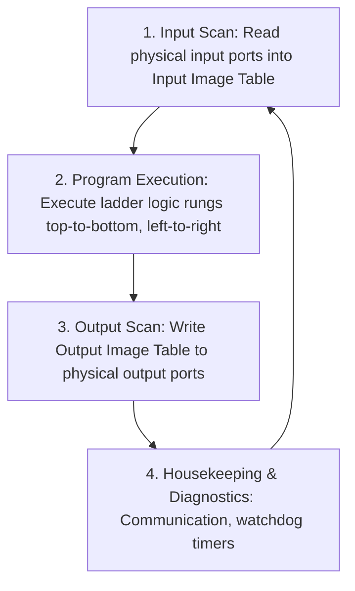

# Module 4: Computer Integrated Manufacturing (CIM), PLCs & Automation

**GATE Section:** Part A.3 (Automation & Computer Integrated Manufacturing)  
**Target:** Industrial Automation Architectures, PLC Ladder Logic, CNC G/M-Codes, AS/RS & AIDC

---

## 1. Automation in Manufacturing

### Automation Types Comparison
| Automation Type | Production Volume | Product Variety / Flexibility | Equipment Setup Cost | Reconfiguration Time | Typical Examples |
| :--- | :--- | :--- | :--- | :--- | :--- |
| **Fixed Automation (Hard)** | Very High ($10^5 - 10^7$ units/yr) | Very Low (Dedicated single product) | Extremely High | Long & complex | Automotive transfer lines, mechanical cam-driven screw machines |
| **Programmable Automation** | Medium to Low ($10^2 - 10^4$) | High (Batch production) | High | Hours/Days to re-program & re-tool | CNC machines, industrial painting/welding robots |
| **Flexible Automation (FMS)** | Medium ($10^3 - 10^5$) | High (Continuous mix of varieties) | High to Very High | Instantaneous (Zero changeover time) | Flexible Manufacturing Systems, Automated assembly cells |

---

## 2. Programmable Logic Controllers (PLCs)

### 1. PLC Hardware Architecture
- **Central Processing Unit (CPU):** Executes control logic, evaluates inputs, updates outputs.
- **Input Modules:** Optical isolation (opto-couplers) protects CPU from high-voltage field signals (pushbuttons, limit switches, proximity sensors).
- **Output Modules:** Relays, Transistors (NPN/PNP for fast DC switching), or Triacs (for AC loads).
- **Memory:** Program memory (ROM/Flash) and Data memory (RAM for I/O registers, timers, counters).

### 2. PLC Scan Cycle (Periodic Loop)

* **Scan Time:** Total time taken for 1 complete cycle (typically $1 \text{ to } 20\text{ ms}$).

### 3. Ladder Logic Programming Elements
* **NO Contact (Examine if Closed - `—[ ]—`):** True ($1$) when the referenced bit/switch is closed.
* **NC Contact (Examine if Open - `—[/]—`):** True ($1$) when the referenced bit/switch is open ($0$).
* **Output Coil (`—( )—`):** Energized ($1$) when the entire rung logic evaluates to TRUE.
* **Timers:**
  * **TON (Timer On-Delay):** Output bit turns ON only after the rung remains continuously TRUE for the preset duration (`PRE`).
  * **TOF (Timer Off-Delay):** Output turns ON immediately when rung goes TRUE, but stays ON for `PRE` duration *after* the rung goes FALSE.
* **Counters:**
  * **CTU (Up-Counter):** Increments accumulated value (`ACC`) on each FALSE-to-TRUE transition. Sets Done bit (`DN`) when `ACC >= PRE`.
  * **CTD (Down-Counter):** Decrements accumulated value.

---

## 3. Computer Numerical Control (CNC) & G-Codes

### 1. Machine Coordinates & Motion Control
* **Right-Hand Rule for Axis Designation:**
  * **Z-axis:** Always aligned along the spindle axis (positive Z is tool moving away from workpiece).
  * **X-axis:** Principal horizontal axis in the plane of the worktable.
  * **Y-axis:** Orthogonal to X and Z ($Y = Z \times X$).

### 2. Standard Preparatory Codes (G-Codes)
| G-Code | Function | Description |
| :--- | :--- | :--- |
| **G00** | Rapid Traverse | Maximum speed non-cutting positioning to $(X, Y, Z)$ |
| **G01** | Linear Interpolation | Straight line cutting motion at programmed feed rate `F` |
| **G02** | Circular Interpolation (Clockwise - CW) | Arc motion CW with radius `R` or arc-center vectors `I, J, K` |
| **G03** | Circular Interpolation (Counter-Clockwise - CCW) | Arc motion CCW |
| **G04** | Dwell | Pauses tool for specified time (e.g. `G04 P2000` = 2 sec) |
| **G17 / G18 / G19** | Plane Selection | XY Plane (G17), XZ Plane (G18), YZ Plane (G19) |
| **G20 / G21** | Units Selection | Inch input (G20), Metric/mm input (G21) |
| **G90 / G91** | Positioning Mode | **Absolute coordinates** (G90), **Incremental coordinates** (G91) |
| **G94 / G95** | Feed rate Mode | Feed per minute (G94 - mm/min), Feed per revolution (G95 - mm/rev) |

### 3. Standard Miscellaneous Codes (M-Codes)
| M-Code | Function |
| :--- | :--- |
| **M00 / M01** | Program Stop / Optional Stop |
| **M02 / M30** | End of Program / Program Reset and Rewind |
| **M03 / M04 / M05** | Spindle ON Clockwise / Spindle ON CCW / Spindle OFF |
| **M06** | Automatic Tool Change (ATC) |
| **M08 / M09** | Coolant ON (Flood) / Coolant OFF |

---

## 4. Automated Material Handling & Storage Systems

### 1. Automated Storage and Retrieval Systems (AS/RS)
* **Components:** Storage racks, S/R machine (crane), input/output pick-up & delivery (P&D) stations.
* **Cycle Time Analysis:**
  * **Single-Command Cycle ($T_{sc}$):** S/R crane performs either 1 storage OR 1 retrieval operation per trip.
    $$T_{sc} = 2 \cdot \max(T_x, T_y) + 2 T_{pd}$$
  * **Dual-Command Cycle ($T_{dc}$):** S/R crane deposits an item into a rack and retrieves another item from a different location in the same round trip.
    $$T_{dc} \approx 1.5 \cdot \max(T_x, T_y) + 4 T_{pd}$$
  Where $T_x = L / v_x$, $T_y = H / v_y$, and $T_{pd}$ is pick-and-deposit transfer time.

### 2. Automated Guided Vehicles (AGVs)
* **Guidance Methods:** Inductive wire in floor, Optical tape, Magnetic grid, Laser triangulation (LIDAR reflectors), Natural feature navigation (SLAM).
* **Delivery Rate Calculation:**
  $$\text{Cycle time per delivery } T_c = \frac{L_{\text{loaded}}}{v_c} + \frac{L_{\text{empty}}}{v_c} + T_{\text{load}} + T_{\text{unload}} + T_{\text{wait}}$$
  $$\text{Deliveries per hour per AGV } R_v = \frac{60}{T_c}$$
  $$\text{Number of AGVs required } n = \frac{\text{Total hourly delivery demand } R_f}{R_v \cdot \text{Traffic efficiency } E_t}$$

---

## 5. Automatic Identification and Data Capture (AIDC)
1. **Optical Barcodes (1D vs 2D):**
   * 1D (UPC, Code 39, Code 128): Stores 20–30 alphanumeric characters linearly.
   * 2D (QR Codes, Data Matrix): Stores 2,000–3,000 bytes with built-in Reed-Solomon error correction.
2. **RFID (Radio Frequency Identification):**
   * **Passive RFID:** No battery; powered entirely by electromagnetic field from the reader (range: 0.1 to 10 meters).
   * **Active RFID:** Battery-powered transponder with onboard transmitter; higher range ($>100\text{ m}$) and large memory buffer.
