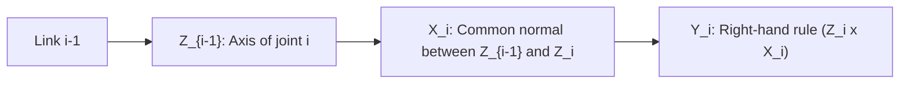

# NPTEL Video Companion Notes: Principles of Robotics & Automation (Part A.3)

**Instructors:** Prof. Ashish Dutta (IIT Kanpur) & Prof. T. Asokan (IIT Madras)  
**Target:** Side-by-side study guide with step-by-step math derivations, diagrams & exam traps

---

## 🎬 Video 1: 2D & 3D Spatial Rotation Matrices ($SO(3)$)

### 📌 Summary of Video Lecture
Prof. Ashish Dutta derives how a point coordinate vector $P$ transforms when a coordinate frame rotates in 3D space:
- A frame $\{B\}$ rotated relative to frame $\{A\}$ is described by 3 column vectors representing the projections of unit vectors $\hat{x}_B, \hat{y}_B, \hat{z}_B$ onto the axes of frame $\{A\}$:
  $$^A R_B = \begin{bmatrix} \hat{x}_B \cdot \hat{x}_A & \hat{y}_B \cdot \hat{x}_A & \hat{z}_B \cdot \hat{x}_A \\ \hat{x}_B \cdot \hat{y}_A & \hat{y}_B \cdot \hat{y}_A & \hat{z}_B \cdot \hat{y}_A \\ \hat{x}_B \cdot \hat{z}_A & \hat{y}_B \cdot \hat{z}_A & \hat{z}_B \cdot \hat{z}_A \end{bmatrix}$$

### ⚡ Critical Mathematical Takeaways
1. **Elementary Rotation Matrices:**
   - About X by angle $\alpha$:
     $$R_x(\alpha) = \begin{bmatrix} 1 & 0 & 0 \\ 0 & \cos\alpha & -\sin\alpha \\ 0 & \sin\alpha & \cos\alpha \end{bmatrix}$$
   - About Y by angle $\beta$:
     $$R_y(\beta) = \begin{bmatrix} \cos\beta & 0 & \sin\beta \\ 0 & 1 & 0 \\ -\sin\beta & 0 & \cos\beta \end{bmatrix} \quad \leftarrow \text{Notice the minus sign is at bottom-left!}$$
   - About Z by angle $\gamma$:
     $$R_z(\gamma) = \begin{bmatrix} \cos\gamma & -\sin\gamma & 0 \\ \sin\gamma & \cos\gamma & 0 \\ 0 & 0 & 1 \end{bmatrix}$$

2. **Composition Rule (Pre vs. Post-Multiplication):**
   - If rotating about the **current (moving) frame axes** $\implies$ **Post-multiply** ($R = R_1 \cdot R_2$).
   - If rotating about the **fixed (base) frame axes** $\implies$ **Pre-multiply** ($R = R_2 \cdot R_1$).

---

## 🎬 Video 2: Homogeneous Transformation Matrices ($4 \times 4$ HTMs)

### 📌 Summary of Video Lecture
To combine rotation ($3 \times 3$) and linear translation ($3 \times 1$) into a single matrix multiplication, we augment vectors to 4D homogeneous coordinates:
$$^A T_B = \begin{bmatrix} ^A R_B & ^A P_{B\text{org}} \\ 0_{1\times3} & 1 \end{bmatrix} = \begin{bmatrix} r_{11} & r_{12} & r_{13} & P_x \\ r_{21} & r_{22} & r_{23} & P_y \\ r_{31} & r_{32} & r_{33} & P_z \\ 0 & 0 & 0 & 1 \end{bmatrix}$$

### ⚡ Shortcut & Trap Alert
* **Inverse of $T$:**
  $$T^{-1} = \begin{bmatrix} R^T & -R^T P \\ 0 & 1 \end{bmatrix}$$
* **Point Transformation:**
  $$\begin{bmatrix} ^A P \\ 1 \end{bmatrix} = ^A T_B \begin{bmatrix} ^B P \\ 1 \end{bmatrix}$$

---

## 🎬 Video 3: Denavit-Hartenberg (D-H) Parametrization

### 📌 Summary of Video Lecture
Prof. Ashish Dutta details the universal standard for attaching coordinate frames to robot links using only **4 parameters**:

### 📋 The 4 Parameters Table Convention:
| Parameter | Name | Defined Along / About | Revolute | Prismatic |
| :---: | :--- | :--- | :---: | :---: |
| $\theta_i$ | **Joint angle** | Angle from $X_{i-1}$ to $X_i$ measured **about $Z_{i-1}$** | **Variable ($\theta_i$)** | Fixed |
| $d_i$ | **Link offset** | Distance from origin $O_{i-1}$ to intersection of $X_i$ with $Z_{i-1}$ measured **along $Z_{i-1}$** | Fixed | **Variable ($d_i$)** |
| $a_i$ | **Link length** | Distance between $Z_{i-1}$ and $Z_i$ measured **along $X_i$** (common normal) | Fixed | Fixed |
| $\alpha_i$ | **Link twist** | Angle from $Z_{i-1}$ to $Z_i$ measured **about $X_i$** | Fixed | Fixed |

### 🧮 Individual Link Transformation Matrix ($^{i-1}T_i$):
$$^{i-1}T_i = \begin{bmatrix} \cos\theta_i & -\sin\theta_i \cos\alpha_i & \sin\theta_i \sin\alpha_i & a_i \cos\theta_i \\ \sin\theta_i & \cos\theta_i \cos\alpha_i & -\cos\theta_i \sin\alpha_i & a_i \sin\theta_i \\ 0 & \sin\alpha_i & \cos\alpha_i & d_i \\ 0 & 0 & 0 & 1 \end{bmatrix}$$

---

## 🎬 Video 4: Robot Applications, End-Effectors & Accuracy/Repeatability

### 📌 Summary of Video Lecture (Prof. T. Asokan)
- **Gripper Types:**
  - **Mechanical Grippers:** Friction grasp vs Form-closure grasp ($F_{\text{grip}} = \frac{m(g + a)}{\mu \cdot n}$).
  - **Vacuum Cups:** Suction force $F = P_{\text{vacuum}} \cdot A \cdot \eta$.
  - **Magnetic:** Ferrous material handling.
- **Accuracy vs. Repeatability:**
  - **Accuracy:** How close the robot tip reaches a commanded mathematical coordinate in 3D space.
  - **Repeatability:** How close the robot tip returns to the *same* point after multiple cycles under identical conditions.
  - In real industrial robots: **Repeatability is much better than Accuracy** ($\pm 0.02\text{ mm}$ vs $\pm 0.5\text{ mm}$).
