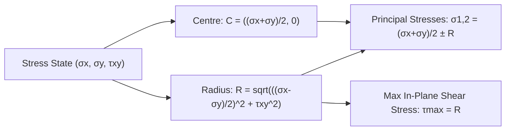

# Module B2.1: Mechanics of Materials (Strength of Materials)

**GATE Section:** Part B2.1 (Mechanical Engineering Optional Stream)  
**Target:** High-Yield Formulas, Mohr's Circle, Deflection, Torsion, Buckling & Strain Rosettes

---

## 1. Stress, Strain & Elastic Constants

### 1. Hooke's Law & Elastic Moduli
* **Young's Modulus ($E$):** $\sigma = E \cdot \epsilon$
* **Shear Modulus ($G$ or $C$):** $\tau = G \cdot \gamma$
* **Bulk Modulus ($K$):** $\sigma_{\text{hydro}} = K \cdot \epsilon_v$ (where $\epsilon_v = \frac{\Delta V}{V} = \epsilon_x + \epsilon_y + \epsilon_z$)
* **Poisson's Ratio ($\nu$ or $\mu$):**
  $$\nu = -\frac{\text{Lateral Strain}}{\text{Longitudinal Strain}}$$
  * Range for engineering metals: $0.25 \le \nu \le 0.35$ (Cork $\approx 0$, Rubber $\approx 0.5$, Perfectly Incompressible Material $\nu = 0.5$).

### 2. Relationships Between Elastic Constants (Must-Remember GATE Formulas)
$$\boxed{E = 2G(1 + \nu)}$$
$$\boxed{E = 3K(1 - 2\nu)}$$
$$\boxed{E = \frac{9KG}{3K + G}}$$
$$\boxed{\nu = \frac{3K - 2G}{6K + 2G}}$$
* Number of independent elastic constants:
  * **Isotropic material:** 2 ($E$ and $\nu$)
  * **Orthotropic material:** 9
  * **Anisotropic material:** 21

---

## 2. Mohr’s Circle for Plane Stress & Principal Stresses

Given stress state $(\sigma_x, \sigma_y, \tau_{xy})$:

### Key Formulas:
1. **Principal Stresses ($\sigma_1, \sigma_2$):**
   $$\sigma_{1,2} = \frac{\sigma_x + \sigma_y}{2} \pm \sqrt{\left(\frac{\sigma_x - \sigma_y}{2}\right)^2 + \tau_{xy}^2}$$
2. **Principal Plane Orientation ($\theta_p$):**
   $$\tan(2\theta_p) = \frac{2\tau_{xy}}{\sigma_x - \sigma_y}$$
   *(Note: The two principal planes are mutually perpendicular, separated by $90^\circ$)*.
3. **Maximum In-Plane Shear Stress ($\tau_{\max}$):**
   $$\tau_{\max} = R = \frac{\sigma_1 - \sigma_2}{2} = \sqrt{\left(\frac{\sigma_x - \sigma_y}{2}\right)^2 + \tau_{xy}^2}$$
4. **Absolute Maximum Shear Stress ($\tau_{\text{abs max}}$ for 3D state with $\sigma_3 = 0$):**
   $$\tau_{\text{abs max}} = \max\left( \left|\frac{\sigma_1 - \sigma_2}{2}\right|, \left|\frac{\sigma_1}{2}\right|, \left|\frac{\sigma_2}{2}\right| \right)$$

---

## 3. Thin Cylinders & Spheres ($t \le D/20$)

* **Thin Cylinder subjected to internal pressure $p$:**
  * **Circumferential / Hoop Stress ($\sigma_h$):** $\sigma_h = \frac{p \cdot d}{2t}$ (Tensile)
  * **Longitudinal Stress ($\sigma_l$):** $\sigma_l = \frac{p \cdot d}{4t}$ (Tensile)
  * **Relationship:** $\sigma_h = 2 \sigma_l$
  * **Maximum In-Plane Shear Stress:** $\tau_{\max} = \frac{\sigma_h - \sigma_l}{2} = \frac{p d}{8t}$
  * **Volumetric Strain ($\epsilon_v$):** $\epsilon_v = 2\epsilon_h + \epsilon_l = \frac{pd}{4tE}(5 - 4\nu)$
* **Thin Sphere:**
  * $\sigma_h = \sigma_l = \frac{p \cdot d}{4t}$
  * $\tau_{\max \text{ (in-plane)}} = 0$, $\tau_{\text{abs max}} = \frac{pd}{8t}$
  * $\epsilon_v = 3\epsilon_h = \frac{3pd}{4tE}(1 - \nu)$

---

## 4. Pure Bending & Shear Force / Bending Moment (SFD & BMD)

### 1. Flexure Formula (Bending Equation):
$$\boxed{\frac{M}{I} = \frac{\sigma_b}{y} = \frac{E}{R}}$$
* **Section Modulus ($Z$):** $\sigma_{b,\max} = \frac{M}{Z}$, where $Z = \frac{I}{y_{\max}}$.
  * Rectangular section ($b \times h$): $Z = \frac{b h^2}{6}$
  * Solid circular section ($\text{dia } d$): $Z = \frac{\pi d^3}{32}$
  * Hollow circular section: $Z = \frac{\pi (D^4 - d^4)}{32 D}$

### 2. Transverse Shear Stress in Beams:
$$\tau = \frac{V \cdot Q}{I \cdot b}$$
* **Rectangular Section:** $\tau_{\max} = \frac{3}{2} \tau_{\text{avg}} = 1.5 \left(\frac{V}{b h}\right)$ (Occurs at Neutral Axis).
* **Solid Circular Section:** $\tau_{\max} = \frac{4}{3} \tau_{\text{avg}} = \frac{4}{3} \left(\frac{V}{\frac{\pi}{4}d^2}\right)$.

---

## 5. Torsion of Circular Shafts

### Torsion Formula:
$$\boxed{\frac{T}{J} = \frac{\tau}{r} = \frac{G \theta}{L}}$$
Where:
- $T$ = Applied twisting torque
- $J$ = Polar Moment of Inertia ($J = \frac{\pi d^4}{32}$ for solid, $J = \frac{\pi (D^4 - d^4)}{32}$ for hollow)
- $\tau_{\max} = \frac{16 T}{\pi d^3}$ (at outer surface $r = d/2$)
- $\theta = \frac{T L}{G J}$ is angle of twist in radians
- **Torsional Rigidity:** $GJ$
- **Torsional Stiffness:** $k_t = \frac{T}{\theta} = \frac{GJ}{L}$

---

## 6. Columns & Euler’s Buckling Theory

Euler's Critical Buckling Load for long, slender columns:
$$\boxed{P_{cr} = \frac{\pi^2 E I_{\min}}{L_e^2}}$$

### Effective Length ($L_e$) for Boundary Conditions:
| Column End Conditions | Effective Length ($L_e$) | Critical Load ($P_{cr}$) |
| :--- | :---: | :---: |
| **Both ends pinned / hinged** | $L$ | $\frac{\pi^2 EI}{L^2}$ |
| **Both ends fixed** | $L/2 = 0.5L$ | $\frac{4\pi^2 EI}{L^2}$ |
| **One end fixed, other free (Cantilever)** | $2L$ | $\frac{\pi^2 EI}{4L^2}$ |
| **One end fixed, other pinned** | $L/\sqrt{2} \approx 0.707L$ | $\frac{2\pi^2 EI}{L^2}$ |

---

## 7. Strain Rosettes & Experimental Stress Analysis

Since strain gauges only measure linear axial strain ($\epsilon$) along their mounting axis, **Strain Rosettes** with 3 gauges are used to solve for the 2D plane strain state $(\epsilon_x, \epsilon_y, \gamma_{xy})$.

### 1. General Rosette Transformation Equation:
$$\epsilon_\theta = \epsilon_x \cos^2\theta + \epsilon_y \sin^2\theta + \gamma_{xy} \sin\theta \cos\theta$$

### 2. Rectangular Rosette ($0^\circ - 45^\circ - 90^\circ$):
- Gauge A at $\theta_A = 0^\circ \implies \epsilon_A = \epsilon_x$
- Gauge C at $\theta_C = 90^\circ \implies \epsilon_C = \epsilon_y$
- Gauge B at $\theta_B = 45^\circ \implies \epsilon_B = \frac{\epsilon_x + \epsilon_y}{2} + \frac{\gamma_{xy}}{2} \implies \gamma_{xy} = 2\epsilon_B - (\epsilon_A + \epsilon_C)$

### 3. Principal Strains ($\epsilon_1, \epsilon_2$):
$$\epsilon_{1,2} = \frac{\epsilon_x + \epsilon_y}{2} \pm \sqrt{\left(\frac{\epsilon_x - \epsilon_y}{2}\right)^2 + \left(\frac{\gamma_{xy}}{2}\right)^2}$$

### 4. Principal Stresses from Strains (Generalized Hooke's Law):
$$\sigma_1 = \frac{E}{1 - \nu^2}(\epsilon_1 + \nu \epsilon_2)$$
$$\sigma_2 = \frac{E}{1 - \nu^2}(\epsilon_2 + \nu \epsilon_1)$$
