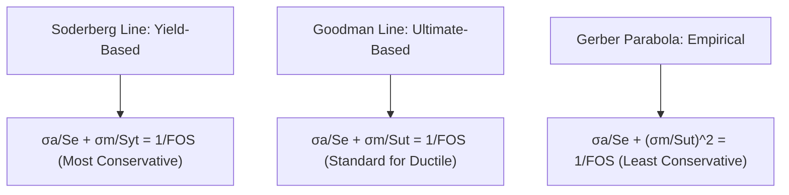
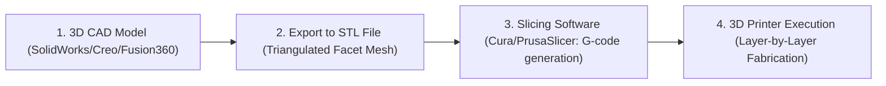

# Module B2.3: Machine Design & Additive Manufacturing

**GATE Section:** Part B2.3 (Mechanical Engineering Optional Stream)  
**Target:** Theories of Failure, Fatigue & S-N Curves, Bearings Rating, Springs & 3D Printing

---

## 1. Theories of Static Failure (Yield Criteria)

Let $\sigma_1 \ge \sigma_2 \ge \sigma_3$ be the principal stresses, and $S_{yt}$ be the yield strength.

| Failure Theory | Criterion Equation | Best Suited For | Graphical Boundary (2D) |
| :--- | :--- | :--- | :--- |
| **Maximum Principal Stress Theory (Rankine)** | $\sigma_1 \le \frac{S_{ut}}{FOS}$ | **Brittle materials** (Cast iron, ceramics) | Square |
| **Maximum Shear Stress Theory (Tresca / Guest)** | $\tau_{\max} = \frac{\sigma_1 - \sigma_3}{2} \le \frac{S_{yt}}{2 \cdot FOS}$ | **Ductile materials** (Conservative design) | Hexagon |
| **Distortion Energy Theory (von Mises / Maxwell-Hencky)** | $\sigma_v = \sqrt{\sigma_1^2 + \sigma_2^2 - \sigma_1\sigma_2} \le \frac{S_{yt}}{FOS}$ | **Ductile materials** (Most accurate) | **Ellipse** |
| **Maximum Principal Strain Theory (St. Venant)** | $\sigma_1 - \nu(\sigma_2 + \sigma_3) \le \frac{S_{yt}}{FOS}$ | Rarely used | Rhombus |
| **Total Strain Energy Theory (Haigh)** | $\sigma_1^2 + \sigma_2^2 - 2\nu\sigma_1\sigma_2 \le \left(\frac{S_{yt}}{FOS}\right)^2$ | Ductile materials | Ellipse |

* **Key Relation for Pure Shear ($\tau$):**
  * By Tresca (MSST): $S_{sy} = 0.5 S_{yt}$
  * By von Mises (DET): $S_{sy} = \frac{1}{\sqrt{3}} S_{yt} \approx \mathbf{0.577 S_{yt}}$ ($15.5\%$ higher yield shear strength than Tresca).

---

## 2. Fatigue Failure & Dynamic Loading (S-N Curve)

For completely reversed cyclic stress ($\sigma_m = 0, \sigma_a = \sigma_{\max}$):
* **Endurance Limit ($S_e$):** Stress amplitude below which a material can withstand infinite stress cycles ($N \ge 10^6$ cycles) without fatigue failure.
  * For steel: $S_e' \approx 0.5 S_{ut}$.
* **Modified Endurance Limit ($S_e$):**
  $$S_e = k_a \cdot k_b \cdot k_c \cdot k_d \cdot k_e \cdot S_e'$$
  Where $k_a$ = surface finish factor, $k_b$ = size factor, $k_c$ = reliability factor, $k_d$ = temperature factor.

### Stress Components for Fluctuating Stress:
* **Mean Stress ($\sigma_m$):** $\sigma_m = \frac{\sigma_{\max} + \sigma_{\min}}{2}$
* **Alternating / Amplitude Stress ($\sigma_a$):** $\sigma_a = \frac{\sigma_{\max} - \sigma_{\min}}{2}$

### Fatigue Failure Criteria (Mean vs. Alternating Stress Lines):

---

## 3. Rolling & Sliding Contact Bearings

### 1. Rolling Contact (Ball & Roller) Bearings:
* **Dynamic Load Capacity ($C$) & Rating Life ($L_{10}$ in million revolutions):**
  $$\boxed{L_{10} = \left(\frac{C}{P}\right)^p}$$
  Where $P$ is equivalent dynamic load ($P = X V F_r + Y F_a$), and the exponent $p$ is:
  * $\mathbf{p = 3}$ for **Ball Bearings**
  * $\mathbf{p = 10/3 \approx 3.33}$ for **Roller Bearings**
* **Life in Operating Hours ($L_{10h}$):**
  $$L_{10h} = \frac{L_{10} \times 10^6}{60 \times N \text{ (rpm)}}$$

### 2. Sliding Contact (Hydrodynamic Journal) Bearings:
* **Sommerfeld Number ($S$ - Dimensionless Bearing Characteristic):**
  $$S = \left(\frac{r}{c}\right)^2 \left(\frac{\mu N_s}{P}\right)$$
  Where $r/c$ = radius-to-clearance ratio, $\mu$ = absolute dynamic viscosity ($\text{Pa}\cdot\text{s}$), $N_s$ = shaft speed in rev/sec, $P = \frac{W}{2 r L}$ = bearing unit projected pressure.
* **Petroff's Law (Friction Torque in Lightly Loaded Bearing):**
  $$T_f = \frac{2\pi^2 \mu N_s L r^3}{c}$$

---

## 4. Mechanical Springs (Helical Compression Springs)

* **Maximum Shear Stress with Wahl Factor ($K_w$):**
  $$\tau_{\max} = K_w \frac{8 F D}{\pi d^3}$$
  Where $D$ = mean coil diameter, $d$ = wire diameter, $C = D/d$ is **Spring Index**, and Wahl factor is:
  $$K_w = \frac{4C - 1}{4C - 4} + \frac{0.615}{C}$$
* **Spring Deflection ($\delta$) & Stiffness ($k$):**
  $$\delta = \frac{8 F D^3 n}{G d^4} \implies \boxed{k = \frac{F}{\delta} = \frac{G d^4}{8 D^3 n}}$$
  (Where $n$ = number of active coils, $G$ = shear modulus).

---

## 5. Additive Manufacturing (3D Printing) & CAD/CAM

### 1. 3D Printing Technologies Comparison
| Process | Material State / Type | Energy / Bonding Source | Working Principle | Typical Applications |
| :--- | :--- | :--- | :--- | :--- |
| **FDM (Fused Deposition Modeling)** | Solid Thermoplastic Filament (PLA, ABS, PETG, Nylon) | Heated Extrusion Nozzle ($200-260^\circ\text{C}$) | Layer-by-layer deposition of molten filament | Rapid prototyping, custom robot brackets & motor mounts |
| **SLA (Stereolithography)** | Liquid Photopolymer Resin | UV Laser / DLP Projector | Photopolymerization (UV curing of liquid resin) | High-precision micro-parts, smooth optical surfaces |
| **SLS (Selective Laser Sintering)** | Fine Powder (Polyamide / Nylon / Metal) | High-power $CO_2$ Laser | Sintering/fusing powder particles; un-sintered powder acts as self-support | Complex functional parts without support structures |
| **DMLS / SLM (Direct Metal Laser Sintering)** | Metal Alloy Powder (Titanium, Inconel, AlSi10Mg) | High-power Fiber Laser | Full melting of metal powder in inert Argon gas chamber | Aerospace, high-stress robotic joints & lightweight topology-optimized links |

### 2. Digital Workflow in Additive Manufacturing:

